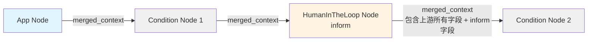

# Condition Node 字段选项说明

## 一、核心问题

**问题**：Condition Node 配置面板中的字段选项是硬编码的 9 个字段，还是动态从上游节点获取？

**答案**：
- **后端执行时**：Condition Node 从上游节点的 `merged_context` 动态获取字段
- **前端配置时**：目前是硬编码的 9 个字段（这是 UI 限制，不是功能限制）

## 二、数据传递机制

### 2.1 数据流原理



### 2.2 关键代码逻辑

**Condition Node 获取上游数据**：
```python
# backend/app/services/workflow/nodes/condition_node.py
def _get_upstream_info(self, state: WorkflowState):
    # 1. 找到上游节点
    upstream_node_id = ...  # 从 edges 中找到
    
    # 2. 获取上游节点的输出
    upstream_output_full = node_results[upstream_node_id]['output']
    
    # 3. 提取 merged_context（这是关键！）
    upstream_context = get_context_from_upstream_output(
        upstream_node_type, 
        upstream_output_full
    )
    # upstream_context 就是条件表达式中可用的所有变量
    
    return {'output': upstream_context}
```

**HumanInTheLoop Node (inform) 构建 merged_context**：
```python
# backend/app/services/workflow/nodes/human_in_the_loop_node.py
merged_context = {
    **(upstream_context or {}),  # ← 包含上游所有字段（App Node 的 9 个字段）
    'task_type': 'inform',        # ← Inform Node 新增字段
    'notification_status': 'sent',
    'notification_timestamp': notification_timestamp,
}
```

## 三、具体场景分析

### 场景：Start → App Node → Condition Node 1 → HumanInTheLoop Node (inform) → Condition Node 2

#### 3.1 数据传递过程

**Step 1: App Node 输出**
```python
{
    'merged_context': {
        # App Node 的 9 个字段
        'has_qualified_option': True,
        'qualified_option_names': ['供应商A', '供应商B'],
        'qualified_option_count': 2,
        'is_request_approved': True,
        'approval_reasons': '符合条件',
        'required_actions': '',
        'is_material_complete': True,
        'missing_materials': [],
        'documentation_status': 'complete'
    }
}
```

**Step 2: Condition Node 1 获取数据**
```python
# Condition Node 1 从 App Node 的 merged_context 获取
upstream_context = {
    'has_qualified_option': True,
    'qualified_option_names': ['供应商A', '供应商B'],
    'qualified_option_count': 2,
    'is_request_approved': True,
    # ... 其他 9 个字段
}

# Condition Node 1 的条件表达式可以使用这 9 个字段
condition_expression = "has_qualified_option === true"
```

**Step 3: HumanInTheLoop Node (inform) 输出**
```python
{
    'merged_context': {
        # 继承上游的所有字段（App Node 的 9 个字段）
        'has_qualified_option': True,
        'qualified_option_names': ['供应商A', '供应商B'],
        'qualified_option_count': 2,
        'is_request_approved': True,
        'approval_reasons': '符合条件',
        'required_actions': '',
        'is_material_complete': True,
        'missing_materials': [],
        'documentation_status': 'complete',
        
        # Inform Node 新增的字段
        'task_type': 'inform',
        'notification_status': 'sent',
        'notification_timestamp': '2024-01-15T10:30:00Z',
        'notification_sent': True,  # 如果实现了方案一
        'total_notified': 5,
        'total_read': 0
    }
}
```

**Step 4: Condition Node 2 获取数据**
```python
# Condition Node 2 从 Inform Node 的 merged_context 获取
upstream_context = {
    # App Node 的 9 个字段（全部保留）
    'has_qualified_option': True,
    'qualified_option_names': ['供应商A', '供应商B'],
    'qualified_option_count': 2,
    'is_request_approved': True,
    'approval_reasons': '符合条件',
    'required_actions': '',
    'is_material_complete': True,
    'missing_materials': [],
    'documentation_status': 'complete',
    
    # Inform Node 新增的字段
    'task_type': 'inform',
    'notification_status': 'sent',
    'notification_timestamp': '2024-01-15T10:30:00Z',
    'notification_sent': True,
    'total_notified': 5,
    'total_read': 0
}

# Condition Node 2 的条件表达式可以使用所有字段！
condition_expression = "task_type === 'inform' && notification_sent === true"
# 或者
condition_expression = "is_request_approved === true && notification_status === 'sent'"
```

## 四、字段选项对比

### 4.1 Condition Node 1 的字段选项

**上游节点**：App Node

**实际可用字段**（后端执行时）：
```
✅ has_qualified_option (boolean)
✅ qualified_option_names (array)
✅ qualified_option_count (number)
✅ is_request_approved (boolean)
✅ approval_reasons (string)
✅ required_actions (string)
✅ is_material_complete (boolean)
✅ missing_materials (array)
✅ documentation_status (string)
```

**前端 UI 显示**（配置时）：
```
✅ 显示固定的 9 个字段（与上游匹配）
```

### 4.2 Condition Node 2 的字段选项

**上游节点**：HumanInTheLoop Node (inform)

**实际可用字段**（后端执行时）：
```
✅ App Node 的 9 个字段（全部保留）：
   - has_qualified_option (boolean)
   - qualified_option_names (array)
   - qualified_option_count (number)
   - is_request_approved (boolean)
   - approval_reasons (string)
   - required_actions (string)
   - is_material_complete (boolean)
   - missing_materials (array)
   - documentation_status (string)

✅ Inform Node 新增的字段：
   - task_type (string) = 'inform'
   - notification_status (string) = 'sent'
   - notification_timestamp (string)
   - notification_sent (boolean) = True  # 如果实现方案一
   - total_notified (number)
   - total_read (number)
```

**前端 UI 显示**（配置时）：
```
⚠️ 目前只显示固定的 9 个字段（UI 限制）
❌ 不显示 Inform Node 新增的字段
```

## 五、问题分析

### 5.1 当前实现的问题

**前端 UI 限制**：
- Condition Node 配置面板硬编码了 9 个字段
- 即使上游是 Inform Node，UI 也不会显示 `task_type`、`notification_status` 等字段
- 用户需要手动输入这些字段名（虽然后端支持）

**后端功能正常**：
- Condition Node 执行时会正确获取所有可用字段
- 条件表达式可以使用任何在 `merged_context` 中的字段
- 包括 App Node 的 9 个字段 + Inform Node 的新字段

### 5.2 实际使用场景

**场景 1：使用 App Node 的字段**
```javascript
// Condition Node 2 可以继续使用 App Node 的字段
条件表达式: "is_request_approved === true"
// ✅ 正常工作，因为 merged_context 保留了所有上游字段
```

**场景 2：使用 Inform Node 的字段**
```javascript
// Condition Node 2 可以使用 Inform Node 的新字段
条件表达式: "task_type === 'inform' && notification_sent === true"
// ✅ 后端正常工作
// ⚠️ 但前端 UI 下拉框中没有这些字段，需要手动输入
```

**场景 3：混合使用**
```javascript
// Condition Node 2 可以混合使用两种字段
条件表达式: "is_request_approved === true && notification_status === 'sent'"
// ✅ 正常工作
```

## 六、UI 预览对比

### 6.1 Condition Node 1 的配置面板

```
┌─────────────────────────────────────────┐
│  Condition Node Configuration          │
├─────────────────────────────────────────┤
│  Upstream: App Node                     │
│                                         │
│  Field: [has_qualified_option ▼]       │
│  Operator: [equals ▼]                   │
│  Value: [true ▼]                        │
│                                         │
│  Available Fields:                      │
│  • Supplier/Resource:                   │
│    - has_qualified_option (boolean)    │
│    - qualified_option_names (array)     │
│    - qualified_option_count (number)   │
│  • Approval/Compliance:                 │
│    - is_request_approved (boolean)     │
│    - approval_reasons (string)          │
│    - required_actions (string)          │
│  • Material/Document:                   │
│    - is_material_complete (boolean)     │
│    - missing_materials (array)          │
│    - documentation_status (string)      │
│                                         │
└─────────────────────────────────────────┘
```

### 6.2 Condition Node 2 的配置面板（当前实现）

```
┌─────────────────────────────────────────┐
│  Condition Node Configuration          │
├─────────────────────────────────────────┤
│  Upstream: HumanInTheLoop Node (inform) │
│                                         │
│  Field: [has_qualified_option ▼]       │
│  Operator: [equals ▼]                   │
│  Value: [true ▼]                        │
│                                         │
│  Available Fields:                      │
│  • Supplier/Resource:                   │
│    - has_qualified_option (boolean)    │
│    - qualified_option_names (array)     │
│    - qualified_option_count (number)   │
│  • Approval/Compliance:                 │
│    - is_request_approved (boolean)     │
│    - approval_reasons (string)          │
│    - required_actions (string)          │
│  • Material/Document:                   │
│    - is_material_complete (boolean)     │
│    - missing_materials (array)          │
│    - documentation_status (string)      │
│                                         │
│  ⚠️ 注意：实际执行时还可以使用：          │
│     - task_type (string)                │
│     - notification_status (string)      │
│     - notification_sent (boolean)       │
│     - notification_timestamp (string)   │
│     - total_notified (number)           │
│     - total_read (number)               │
│     （需要手动输入字段名）                │
│                                         │
└─────────────────────────────────────────┘
```

### 6.3 Condition Node 2 的理想配置面板（未来改进）

```
┌─────────────────────────────────────────┐
│  Condition Node Configuration          │
├─────────────────────────────────────────┤
│  Upstream: HumanInTheLoop Node (inform) │
│                                         │
│  Field: [task_type ▼]                   │
│  Operator: [equals ▼]                   │
│  Value: [inform ▼]                      │
│                                         │
│  Available Fields:                      │
│  • Supplier/Resource:                   │
│    - has_qualified_option (boolean)    │
│    - qualified_option_names (array)     │
│    - qualified_option_count (number)    │
│  • Approval/Compliance:                 │
│    - is_request_approved (boolean)     │
│    - approval_reasons (string)          │
│    - required_actions (string)          │
│  • Material/Document:                   │
│    - is_material_complete (boolean)     │
│    - missing_materials (array)          │
│    - documentation_status (string)      │
│  • Notification (from Inform Node):      │
│    - task_type (string)                 │
│    - notification_status (string)       │
│    - notification_sent (boolean)        │
│    - notification_timestamp (string)    │
│    - total_notified (number)            │
│    - total_read (number)                │
│                                         │
└─────────────────────────────────────────┘
```

## 七、总结

### 7.1 关键结论

1. **后端执行时**：
   - Condition Node 2 可以使用 **所有字段**（App Node 的 9 个 + Inform Node 的新字段）
   - 数据通过 `merged_context` 完整传递，不会丢失

2. **前端配置时**：
   - Condition Node 2 的 UI 只显示固定的 9 个字段
   - Inform Node 的新字段需要手动输入（但后端支持）

3. **实际可用性**：
   - ✅ 可以继续使用 App Node 的 9 个字段
   - ✅ 可以使用 Inform Node 的新字段（手动输入）
   - ⚠️ UI 体验不够友好（需要手动输入字段名）

### 7.2 建议

**短期方案**（当前可用）：
- 用户可以在条件表达式中手动输入 Inform Node 的字段名
- 后端会正确执行，只是 UI 不支持下拉选择

**长期改进**（未来优化）：
- 前端动态获取上游节点的 `merged_context` 结构
- 根据上游节点类型动态显示字段选项
- 支持所有节点类型的字段自动发现

