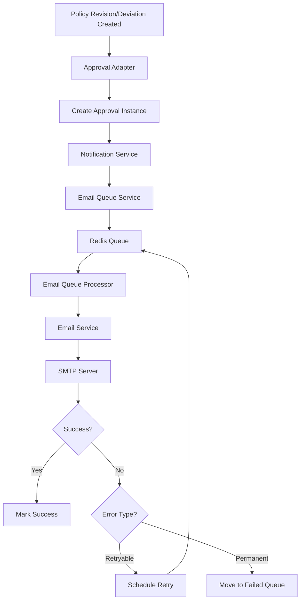
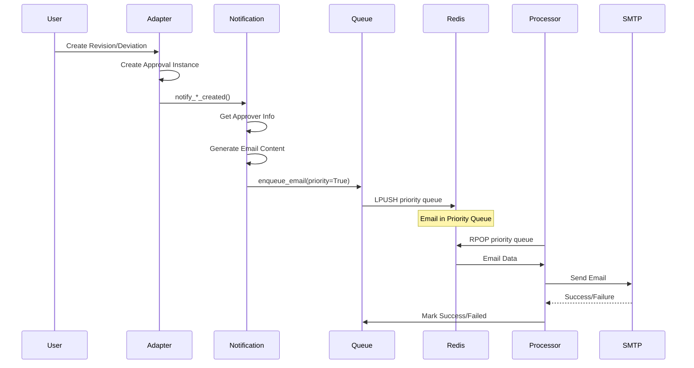
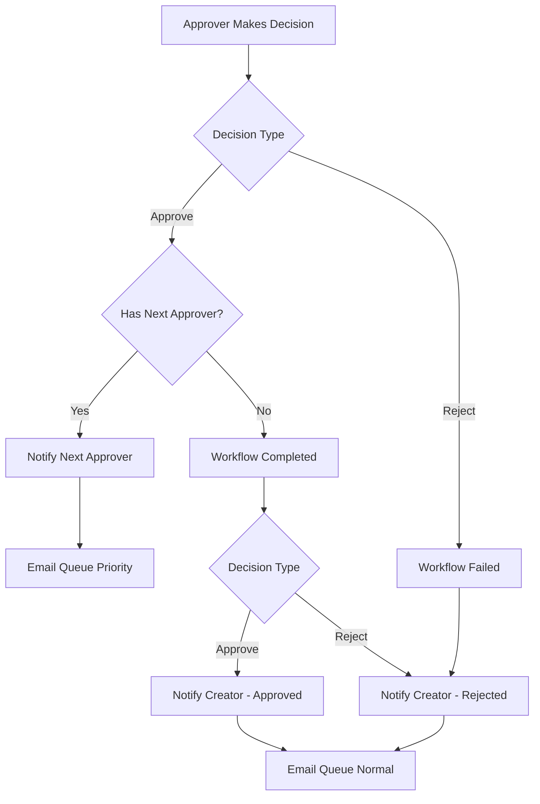
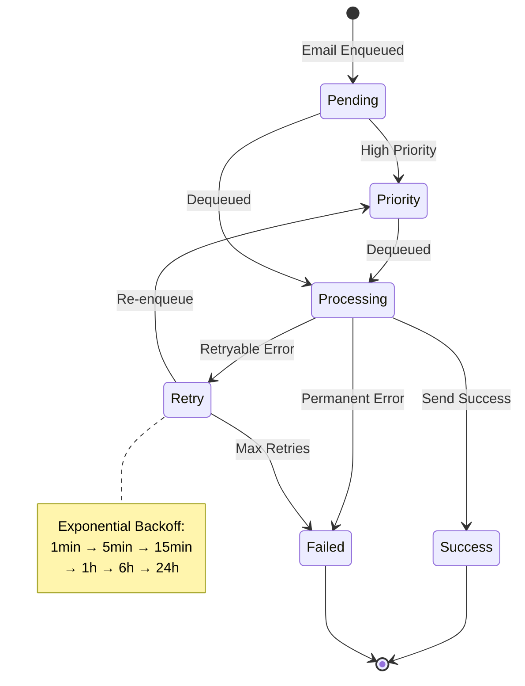
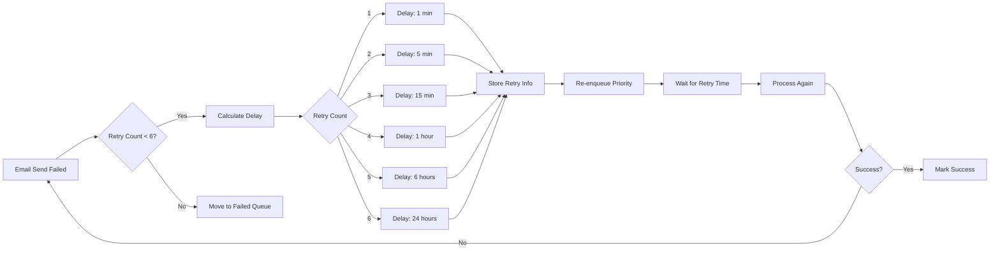
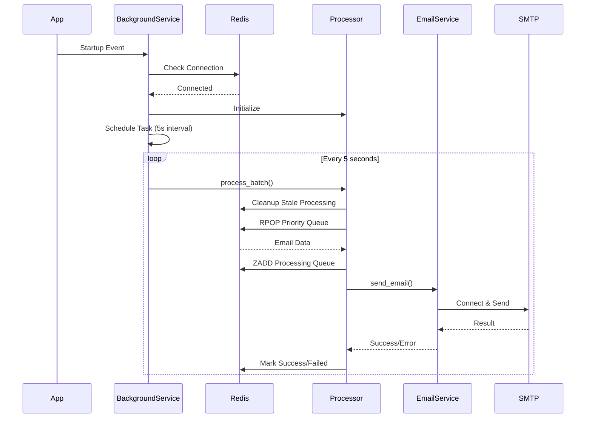
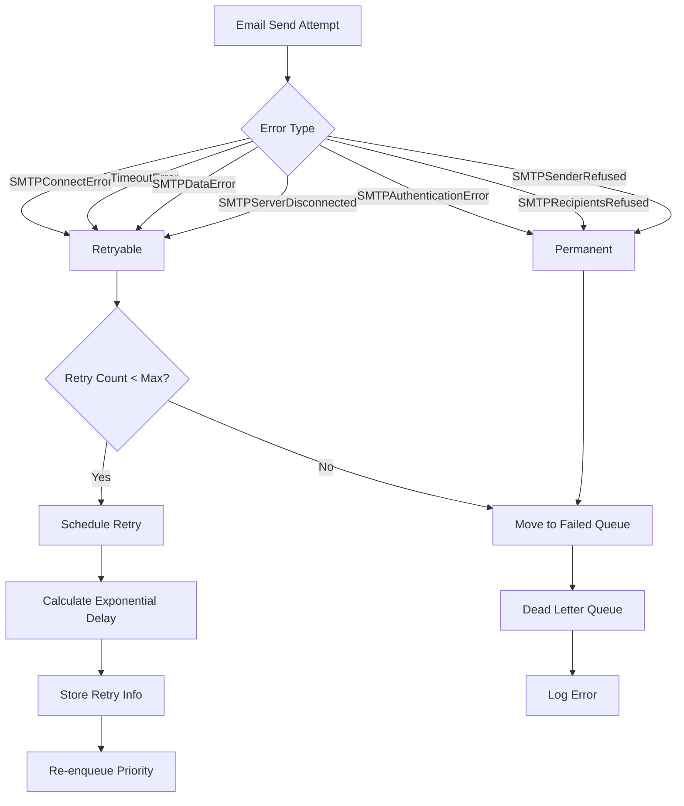
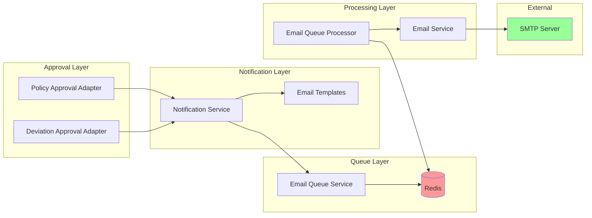
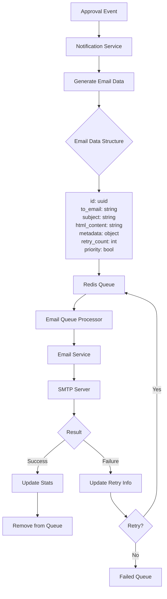
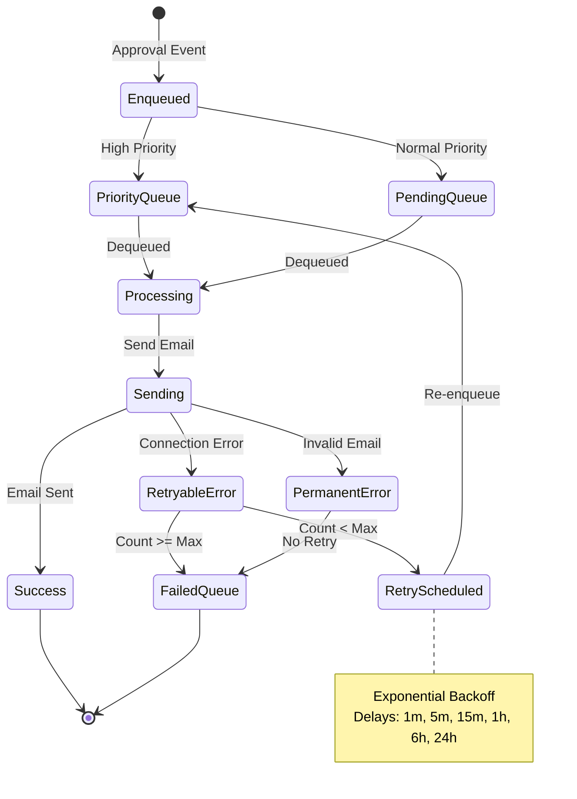

# Email Notification System - Flow Diagrams

## 1. Overall System Architecture

## 2. Approval Instance Creation Flow

## 3. Approval Decision Flow

## 4. Email Queue Processing Flow

## 5. Retry Mechanism Flow

## 6. Background Task Processing

## 7. Error Handling Flow

## 8. Component Interaction Diagram

## 9. Data Flow Diagram

## 10. Complete Notification Lifecycle

