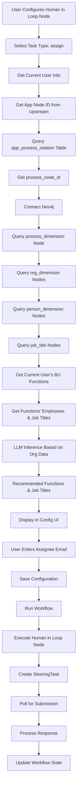

# Human in the Loop Node Assign Task Type 实施计划

## 一、需求概述

在 Human in the Loop Node 中新增 `assign` 任务类型,支持将任务分配给指定用户。在配置阶段,基于当前用户的组织架构信息和 Neo4j 图数据库提供智能推荐功能,帮助用户选择合适的被分配人。

## 二、关键纠正点

**重要**: Workflow 是在全部配置完成后点击 run 才运行的,运行后不支持修改节点配置。因此在配置 Human in the Loop Node 的 task type 为 assign 时:

- 上游节点还未运行,即使有 `required_actions` 字段也一定是空的
- **LLM 推测时不需要且无法获取 `required_actions` 内容**
- 智能推荐只能基于:
  1. 当前用户的 function 和 job title (从 PostgreSQL 获取)
  2. App Node 的 `app_node_id` → 查询 `app_process_relation` 表获取 `process_node_id`
  3. Neo4j 图数据库中的组织架构数据:
     - `process_dimension` 节点
     - `person_dimension` 节点
     - `org_dimension` 节点
     - `job_title` 节点

## 三、核心功能点

### 1. SteeringTask 支持检查

- ✅ **已支持**: SteeringTask 模型和 API 已支持 `task_type: "assign"`
- 无需额外修改

### 2. 配置界面改造 (前端)

**文件**: `frontend/src/components/Workbench/HumanInTheLoopConfig.tsx`

**修改点**:

- Task Type 下拉菜单新增 `assign` 选项 (第 307 行后)
- 当 `taskType === 'assign'` 时:
  - 显示 "ASSIGN CONFIGURATION" 标题 (替换 "UPDATE CONFIGURATION")
  - "Update Title" 改为 "Assign Title"
  - "Description" 保留
  - "Update by Job Title" 功能隐藏
  - 新增文本输入框用于输入被 assign 人的账户(邮箱格式)
  - 显示推荐的 function(部门)和 job title (从后端 API 获取)

**新增功能**:

- 添加 `assignConfig` 状态管理 (类似 `updateConfig`)
- 实现智能推荐数据的获取和显示
- 添加推荐 function 和 job title 的展示组件
- 在输入框下方显示推荐的 function 和 job title,帮助用户选择

### 3. 智能推荐功能 (后端)

**新增文件**: `backend/app/services/workflow/nodes/assign_recommendation_service.py`

**核心逻辑**:

1. **获取当前用户信息**:
   - 从请求中获取当前用户 (通过 `CurrentUser` dependency)
   - 从 PostgreSQL 查询当前用户的 `function_id`, `business_unit_id`, `job_title_id`
   - 获取当前用户所属的 function 和 job title 信息

2. **获取 App Node 关联的 process_node_id**:
   - 根据上游 App Node 的 `app_node_id` 查询 `app_process_relation` 表
   - 获取对应的 `process_node_id` (Neo4j element_id)

3. **连接 Neo4j 图数据库**:
   - 使用 `backend/app/services/neo4j_service.py` 中的 `Neo4jService`
   - 连接信息从环境变量获取: `NEO4J_URI`, `NEO4J_USERNAME`, `NEO4J_PASSWORD`

4. **查询 Neo4j 组织架构数据**:
   - 根据 `process_node_id` 查找 `process_dimension` 节点
   - 查询相关的 `org_dimension` 节点 (function/部门信息)
   - 查询相关的 `person_dimension` 节点 (人员信息)
   - 查询相关的 `job_title` 节点 (职务信息)
   - 获取当前用户所在 business unit 下的所有 functions
   - 获取这些 functions 下的所有 employees 和 job titles

5. **调用大模型推理**:
   - 参考 `backend/app/services/workflow/workflow_execution_service.py` 中的 `_extract_structured_output` 方法
   - 使用 `AzureChatOpenAI` 或配置的 LLM 客户端
   - **Prompt 设计**:
     - 输入: 所有的 function 和 job title (当前用户所在 business unit 下的所有 functions 及其 employees 和 job titles),Neo4j 组织架构数据 (functions, employees, job titles)
     - **不包含** `required_actions` (因为配置时上游节点还未运行)
     - 输出: 推荐的 function 列表和 job title 列表
   - 大模型基于所有组织架构数据推测可能的 function 和 job title

**API 端点** (新增):

- `GET /api/v1/workflow/nodes/assign-recommendations?app_node_id={id}`
- 需要认证,自动获取当前用户信息
- 返回格式:
  ```json
  {
    "recommended_functions": [
      {
        "id": 1,
        "name": "DCMC Operations",
        "code": "DCMC_OPS",
        "description": "Operations function"
      }
    ],
    "recommended_job_titles": [
      {
        "id": 10,
        "name": "Operations Manager",
        "code": "OPS_MGR",
        "description": "Manages operations"
      }
    ],
    "current_user_context": {
      "function": {
        "id": 5,
        "name": "DCMC Information"
      },
      "job_title": {
        "id": 8,
        "name": "IT Manager"
      },
      "business_unit": {
        "id": 1,
        "name": "DCMC"
      }
    }
  }
  ```

### 4. Human in the Loop Node 执行逻辑 (后端)

**文件**: `backend/app/services/workflow/nodes/human_in_the_loop_node.py`

**修改点**:

1. `__init__` 方法: 添加 `assign_config` 配置读取 (第 35 行后)
   ```python
   self.assign_config = config.get('assignConfig', {})
   ```

2. `execute` 方法: 添加 `assign` 任务类型的执行分支 (第 122 行后)
   ```python
   if self.task_type == 'assign':
       return await self._execute_assign(...)
   ```

3. 新增 `_execute_assign` 方法:
   - 从 `assignConfig` 获取 assignee 账户(邮箱)
   - 根据邮箱查找用户 ID
   - 创建 SteeringTask (task_type="assign")
   - 设置 pending 状态并开始轮询

4. 新增 `_create_assign_task` 方法:
   - 根据邮箱查找用户
   - 验证用户存在且为 ACTIVE 状态
   - 创建 SteeringTask (task_type="assign")
   - 返回 task_id 和 assignee 信息

5. 新增 `_poll_for_assign_submission` 方法:
   - 轮询等待被 assign 人提交任务
   - 提取提交信息 (类似 `_poll_for_update_submission`)
   - 返回 `assign_info` 和 `file_ingestion_record_ids`

6. `process_human_decision` 方法: 添加 `assign` 类型的处理逻辑 (第 736 行后)

**返回值设计**:

```python
{
    'human_decision': 'assigned',  # 或 'completed'
    'decision_reason': assign_info,  # 被 assign 人提交的信息
    'structured_output': {
        'task_type': 'assign',
        'human_decision': 'assigned',
        'is_assigned': True,
        'assign_info': assign_info,  # 被 assign 人提交的信息
        'file_ingestion_record_ids': file_ingestion_record_ids,  # 附件 ID 列表
        'assignee_email': assignee_email,
        'assignee_job_title': assignee_job_title,
        'decision_timestamp': decision_timestamp,
    },
    'upstream_context': upstream_context,
    'merged_context': {
        **upstream_context,
        'task_type': 'assign',
        'human_decision': 'assigned',
        'assign_info': assign_info,
    },
    '_metadata': {
        **metadata,
        'assignee_id': assignee_id,
        'assignee_email': assignee_email,
        'assignee_job_title_id': assignee_job_title_id,
        'assignee_job_title_name': assignee_job_title_name,
        'decision_timestamp': decision_timestamp,
    }
}
```

### 5. 消息中心支持 (前端)

**文件**: `frontend/src/components/MessageCenter/TaskDetailModal.tsx`

**修改点**:

1. `getTaskTypeLabel` 函数: 已支持 `assign` (第 44 行)

2. 添加 `assign` 类型的显示逻辑 (第 728 行后):
   - 显示 "Assign" badge
   - 显示 Assign Title 和 Description
   - 显示 Create Time 和 Due Time
   - 显示 "Assign Info" 区域 (类似 "Update Info")
   - 支持附件上传 (复用 request_for_update 的附件上传逻辑)

3. 提交逻辑: 添加 `assign` 类型的提交处理 (第 615 行后)
   - 提交时包含 `assign_info` 和 `file_ingestion_record_ids`

### 6. Workflow 节点显示 (前端)

**文件**: `frontend/src/components/Workbench/NodeOutputPanel.tsx` 或相关节点显示组件

**修改点**:

- 当 Task Type 为 `assign` 时,显示对应的副标题
- 格式与 `approval` 类型保持一致
- 显示 "Assign to: {assignee_email}"

## 四、数据流设计



## 五、关键技术实现细节

### 1. 获取当前用户信息

**实现方式**:

```python
from app.api.deps import CurrentUser
from app.models import User, Function, JobTitle, BusinessUnit

# 在 API 端点中
def get_assign_recommendations(
    app_node_id: int,
    current_user: CurrentUser,
    session: SessionDep
):
    # 获取当前用户的组织架构信息
    user_function = None
    user_job_title = None
    user_business_unit = None
    
    if current_user.function_id:
        user_function = session.get(Function, current_user.function_id)
    if current_user.job_title_id:
        user_job_title = session.get(JobTitle, current_user.job_title_id)
    if current_user.business_unit_id:
        user_business_unit = session.get(BusinessUnit, current_user.business_unit_id)
    
    # 获取当前用户所在 business unit 下的所有 functions
    if user_business_unit:
        functions = session.exec(
            select(Function).where(Function.business_unit_id == user_business_unit.id)
        ).all()
```

### 2. Neo4j 查询逻辑

**实现方式**:

```python
from app.services.neo4j_service import Neo4jService

neo4j_service = Neo4jService()

# 根据 process_node_id 查询 process_dimension 节点
process_query = """
MATCH (p:process_dimension)
WHERE elementId(p) = $process_node_id
RETURN p
"""
process_node = neo4j_service.run_query(process_query, {"process_node_id": process_node_id})

# 查询相关的 org_dimension 节点 (functions)
org_query = """
MATCH (p:process_dimension)-[:RELATED_TO]->(o:org_dimension)
WHERE elementId(p) = $process_node_id
RETURN o
"""
org_nodes = neo4j_service.run_query(org_query, {"process_node_id": process_node_id})

# 查询相关的 person_dimension 节点
person_query = """
MATCH (p:process_dimension)-[:HAS_PERSON]->(person:person_dimension)
WHERE elementId(p) = $process_node_id
RETURN person
"""
person_nodes = neo4j_service.run_query(person_query, {"process_node_id": process_node_id})

# 查询相关的 job_title 节点
job_title_query = """
MATCH (person:person_dimension)-[:HAS_JOB_TITLE]->(jt:job_title)
WHERE person IN $person_nodes
RETURN DISTINCT jt
"""
job_titles = neo4j_service.run_query(job_title_query, {"person_nodes": person_nodes})
```

### 3. 大模型推理 Prompt 设计

**关键点**: **不包含 `required_actions`**,因为配置时上游节点还未运行

**Prompt 模板**:

```
你是一个组织架构分析助手。根据以下信息,推荐适合分配任务的部门和职务。

组织架构数据 (来自 Neo4j 图数据库):
- 流程维度: {process_dimension_info}
- 相关部门列表: {functions_list}
- 相关人员列表: {persons_list}
- 相关职务列表: {job_titles_list}

当前用户所在业务单元下的所有部门:
{all_functions_in_bu}

这些部门下的所有员工和职务:
{employees_and_job_titles}

所有可用的部门和职务信息:
- 所有部门列表: {all_functions_list}
- 所有职务列表: {all_job_titles_list}

请基于以上所有组织架构信息 (包括所有部门、所有员工、所有职务),推荐:
1. 可能的部门 (functions) - 列出 3-5 个最相关的部门
2. 可能的职务 (job titles) - 列出 3-5 个最相关的职务

输出 JSON 格式:
{
  "recommended_functions": [
    {"id": 1, "name": "部门名称", "reason": "推荐原因"}
  ],
  "recommended_job_titles": [
    {"id": 10, "name": "职务名称", "reason": "推荐原因"}
  ]
}
```

### 4. 数据库查询

**PostgreSQL 查询**:

```python
from sqlmodel import select
from app.models import AppProcessRelation, User, Function, JobTitle, BusinessUnit

# 查询 app_process_relation 表
relation = session.exec(
    select(AppProcessRelation).where(
        AppProcessRelation.app_node_id == app_node_id,
        AppProcessRelation.yn == True
    )
).first()

if relation:
    process_node_id = relation.process_node_id

# 查询当前用户所在 business unit 下的所有 functions
if current_user.business_unit_id:
    functions = session.exec(
        select(Function).where(Function.business_unit_id == current_user.business_unit_id)
    ).all()
    
    # 查询这些 functions 下的所有 employees
    employees = session.exec(
        select(User).where(
            User.function_id.in_([f.id for f in functions]),
            User.account_status == AccountStatus.ACTIVE.value
        )
    ).all()
    
    # 获取这些 employees 的所有 job titles
    job_title_ids = [e.job_title_id for e in employees if e.job_title_id]
    job_titles = session.exec(
        select(JobTitle).where(JobTitle.id.in_(job_title_ids))
    ).all()
```

## 六、实施步骤

### 阶段一: 后端智能推荐服务 (优先级: 高)

1. **创建智能推荐服务**
   - 创建 `backend/app/services/workflow/nodes/assign_recommendation_service.py`
   - 实现获取当前用户信息的逻辑
   - 实现查询 `app_process_relation` 表的逻辑
   - 实现 Neo4j 查询逻辑
   - 实现大模型推理逻辑 (不包含 `required_actions`)

2. **创建 API 端点**
   - 在 `backend/app/api/v1/workflow/` 下创建或修改路由文件
   - 创建 `GET /api/v1/workflow/nodes/assign-recommendations` 端点
   - 需要认证,自动获取当前用户
   - 返回推荐的 function 和 job title 列表

### 阶段二: 后端执行逻辑 (优先级: 高)

1. **修改 human_in_the_loop_node.py**
   - 在 `__init__` 方法中添加 `assign_config` 读取
   - 在 `execute` 方法中添加 `assign` 分支
   - 实现 `_execute_assign` 方法
   - 实现 `_create_assign_task` 方法
   - 实现 `_poll_for_assign_submission` 方法
   - 在 `process_human_decision` 方法中添加 `assign` 类型处理

### 阶段三: 前端配置界面 (优先级: 高)

1. **修改 HumanInTheLoopConfig.tsx**
   - 在 Task Type 下拉菜单中添加 `assign` 选项
   - 添加 `assignConfig` 状态管理
   - 实现 Assign Configuration UI:
     - Assign Title 输入框
     - Description 文本域
     - Assignee 账户输入框 (邮箱格式)
     - 推荐信息显示区域
   - 集成智能推荐 API 调用
   - 隐藏 "Update by Job Title" 功能 (当 taskType 为 assign 时)

### 阶段四: 消息中心支持 (优先级: 中)

1. **修改 TaskDetailModal.tsx**
   - 添加 `assign` 类型的显示逻辑
   - 实现 Assign Info 输入区域
   - 支持附件上传 (复用 request_for_update 逻辑)
   - 实现提交处理逻辑

### 阶段五: 节点显示优化 (优先级: 低)

1. **更新节点显示组件**
   - 当 Task Type 为 `assign` 时显示对应的副标题
   - 显示被分配人信息

## 七、注意事项

### 1. 错误处理

- **Neo4j 连接失败**: 降级处理,返回空推荐列表,提示用户手动输入
- **大模型调用失败**: 返回基于组织架构的简单推荐 (不调用 LLM)
- **用户邮箱不存在**: 在配置时验证邮箱格式,执行时验证用户存在
- **app_process_relation 表无数据**: 返回空推荐列表,提示用户手动输入

### 2. 性能优化

- **智能推荐结果缓存**: 可选,缓存时间 5-10 分钟
- **Neo4j 查询优化**: 使用索引,限制查询结果数量
- **大模型调用优化**: 设置合理的 timeout,失败时快速降级

### 3. 数据一致性

- 确保 `app_process_relation` 表数据正确
- 确保 Neo4j 组织架构数据与 PostgreSQL 同步
- 确保用户邮箱唯一性

### 4. 用户体验

- 推荐信息清晰展示,包含推荐原因
- 输入框支持邮箱格式验证
- 输入框下方显示推荐的 function 和 job title,帮助用户选择
- 错误提示友好,提供降级方案

## 八、测试要点

### 1. 配置界面测试

- Task Type 切换功能
- Assign Configuration UI 显示
- 智能推荐 API 调用和数据显示
- Assignee 账户输入和验证
- 配置保存和加载

### 2. 执行逻辑测试

- SteeringTask 创建 (task_type="assign")
- 轮询机制正常工作
- 返回值结构正确
- 错误处理 (用户不存在,邮箱格式错误等)

### 3. 消息中心测试

- Assign 类型消息显示
- Assign Info 输入和提交
- 附件上传功能
- 提交后 workflow 继续执行

### 4. 智能推荐测试

- 当前用户信息获取
- app_process_relation 表查询
- Neo4j 查询 (各种边界情况)
- 大模型推理 (成功和失败场景)
- 推荐结果准确性

### 5. 集成测试

- 完整流程: 配置 → 运行 → 分配 → 提交 → 继续
- 多个 assign 节点串联
- 错误场景处理

## 九、关键代码位置参考

- **Neo4j 服务**: `backend/app/services/neo4j_service.py`
- **大模型调用示例**: `backend/app/services/workflow/workflow_execution_service.py` 中的 `_extract_structured_output` 方法
- **用户模型**: `backend/app/models.py` 中的 `User` 类
- **组织架构模型**: `backend/app/models.py` 中的 `Function`, `JobTitle`, `BusinessUnit` 类
- **App Process Relation 模型**: `backend/app/models.py` 中的 `AppProcessRelation` 类
- **SteeringTask 模型**: `backend/app/models.py` 中的 `SteeringTask` 类
- **前端配置组件**: `frontend/src/components/Workbench/HumanInTheLoopConfig.tsx`
- **消息中心组件**: `frontend/src/components/MessageCenter/TaskDetailModal.tsx`

## 十、总结

本计划修正了原计划中的关键错误: **在配置阶段无法获取 `required_actions` 内容**。智能推荐功能现在完全基于:

1. 当前用户所在 business unit 下的所有 functions 及其 employees 和 job titles
2. App Node 关联的 process_node_id
3. Neo4j 图数据库中的组织架构数据 (所有相关的 functions, employees, job titles)
4. 大模型基于所有组织架构数据的推理 (不包含 `required_actions`,不局限于当前用户的 function 和 job title)

这样可以确保在配置阶段就能提供有用的推荐信息,帮助用户选择合适的被分配人。大模型会综合考虑所有可用的部门和职务信息,而不仅仅是当前用户的信息。
