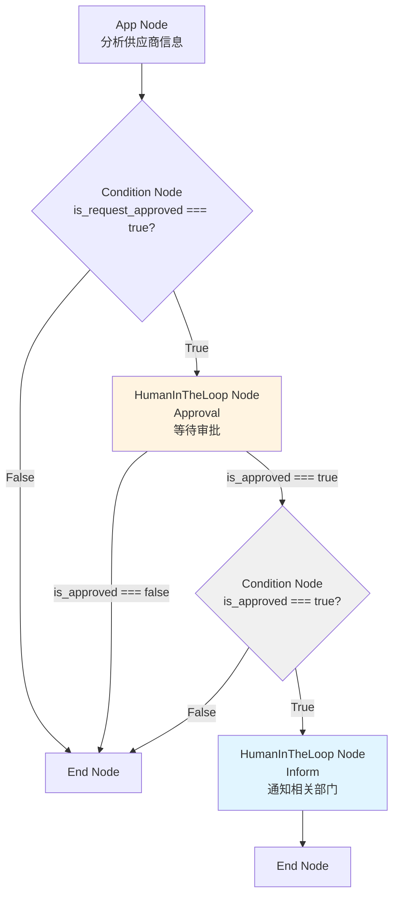
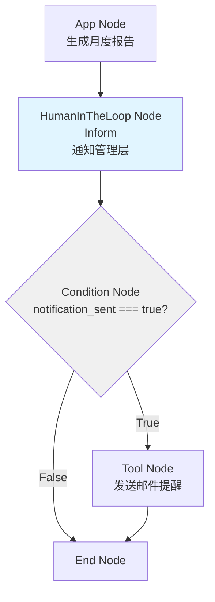
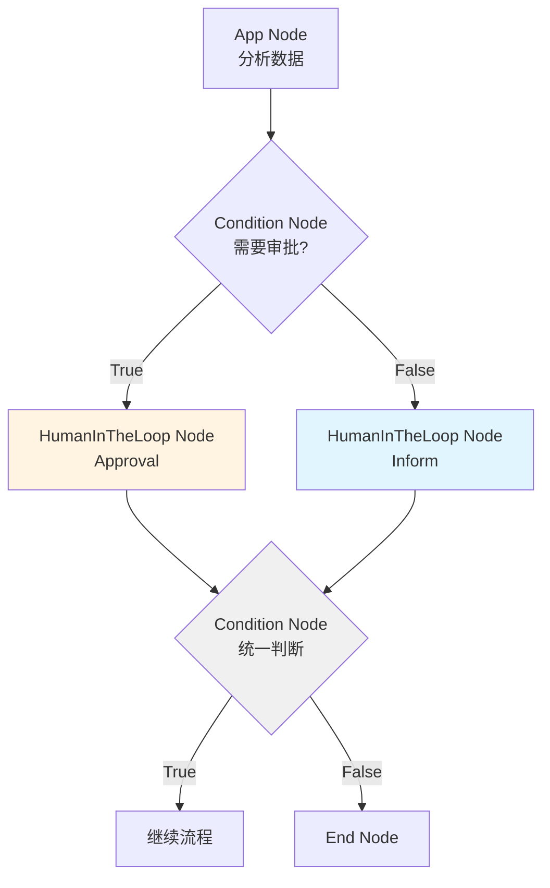

# Inform Task Type 下游节点处理说明

## 一、问题核心

当 HumanInTheLoop Node 的 `task_type` 为 `inform` 时，输出结构中的 `is_approved` 字段为 `None`（表示不适用）。下游节点（特别是 Condition Node）在评估条件表达式时，如果直接使用 `is_approved`，可能会遇到问题。

## 二、为什么需要特殊处理？

### 2.1 数据流示例

```
HumanInTheLoop Node (approval)
  ↓ merged_context
  {
    "task_type": "approval",
    "is_approved": true,        ← 有明确值
    "human_decision": "approved"
  }
  ↓
Condition Node
  条件表达式: "is_approved === true"
  结果: ✅ 正常工作
```

```
HumanInTheLoop Node (inform)
  ↓ merged_context
  {
    "task_type": "inform",
    "is_approved": None,        ← None 值
    "notification_sent": true,
    "notification_status": "sent"
  }
  ↓
Condition Node
  条件表达式: "is_approved === true"
  结果: ❌ 可能返回 False（因为 None !== true）
        但这不是我们想要的逻辑！
```

### 2.2 问题场景

**错误示例**：
```python
# Condition Node 的条件表达式
condition = "is_approved === true"

# 如果上游是 inform 类型
context = {
    "task_type": "inform",
    "is_approved": None,
    "notification_sent": True
}

# 评估结果
result = (None === true)  # False
# ❌ 问题：inform 类型不应该用 is_approved 来判断
```

## 三、业务场景示例

### 场景1：审批通过后发送通知

**工作流结构**：
```
App Node (分析供应商)
  ↓
Condition Node (判断是否通过)
  ├─ True → HumanInTheLoop Node (Approval) → 审批通过后 → HumanInTheLoop Node (Inform) → End
  └─ False → HumanInTheLoop Node (Approval) → 审批拒绝后 → End
```

**详细流程**：



**关键点**：
- 第一个 Condition Node：检查 App Node 的 `is_request_approved`
- 第二个 Condition Node：检查 Approval Node 的 `is_approved`
- Inform Node：不需要条件判断，直接执行

**Condition Node 配置**：
```javascript
// Condition Node 1 (在 Approval 之后)
条件表达式: "is_approved === true"
True 分支: "通知相关部门"
False 分支: "结束流程"
```

**问题**：如果 Inform Node 的输出被误用，`is_approved: None` 会导致条件判断错误。

### 场景2：根据通知状态决定后续操作

**工作流结构**：
```
App Node (生成报告)
  ↓
HumanInTheLoop Node (Inform) - 通知管理层
  ↓
Condition Node (检查通知状态)
  ├─ True → Tool Node (发送邮件提醒)
  └─ False → End Node
```

**详细流程**：



**Condition Node 配置**：
```javascript
// 正确的条件表达式
条件表达式: "task_type === 'inform' && notification_sent === true"
// 或者
条件表达式: "notification_status === 'sent'"
```

**关键点**：
- 必须检查 `task_type` 或使用 inform 专用字段
- 不能直接使用 `is_approved`

### 场景3：混合场景 - 审批和通知并行

**工作流结构**：
```
App Node (分析)
  ↓
Condition Node (判断是否需要审批)
  ├─ True → HumanInTheLoop Node (Approval)
  └─ False → HumanInTheLoop Node (Inform)
  ↓
Condition Node (统一判断)
  ├─ True → 继续流程
  └─ False → 结束
```

**详细流程**：



**Condition Node 配置（统一判断）**：
```javascript
// 需要同时支持 approval 和 inform
条件表达式: "(task_type === 'approval' && is_approved === true) || (task_type === 'inform' && notification_sent === true)"
```

## 四、解决方案：下游节点处理逻辑

### 4.1 Condition Node 的处理逻辑

**当前实现**（需要改进）：
```python
# backend/app/services/workflow/nodes/condition_node.py
def _evaluate_condition(self, expression: str, context: Dict[str, Any]) -> bool:
    # 直接评估表达式
    result = eval(python_expr, {"__builtins__": {}}, eval_context)
    return bool(result)
```

**改进方案**（推荐）：
```python
def _evaluate_condition(self, expression: str, context: Dict[str, Any]) -> bool:
    # 检查上游节点类型
    task_type = context.get('task_type')
    
    # 如果上游是 inform 类型，且表达式使用了 is_approved
    if task_type == 'inform' and 'is_approved' in expression:
        logger.warning(
            f"[WF][condition] node_id={self.node_id} "
            f"Expression uses 'is_approved' but upstream is 'inform' type. "
            f"Consider using 'notification_sent' instead."
        )
        # 可以选择：
        # 1. 抛出错误，提示用户修改表达式
        # 2. 自动转换：is_approved → notification_sent
        # 3. 返回 False（保守策略）
    
    # 正常评估
    result = eval(python_expr, {"__builtins__": {}}, eval_context)
    return bool(result)
```

### 4.2 用户配置建议

**最佳实践**：在 Condition Node 的条件表达式中，明确检查 `task_type`：

```javascript
// ✅ 推荐：明确检查 task_type
条件表达式: "task_type === 'approval' && is_approved === true"

// ✅ 推荐：使用 inform 专用字段
条件表达式: "task_type === 'inform' && notification_sent === true"

// ✅ 推荐：统一处理（支持两种类型）
条件表达式: "(task_type === 'approval' && is_approved === true) || (task_type === 'inform' && notification_sent === true)"

// ❌ 不推荐：直接使用 is_approved（可能遇到 None）
条件表达式: "is_approved === true"
```

## 五、UI 预览

### 5.1 Condition Node 配置面板

当 Condition Node 的上游是 HumanInTheLoop Node 时，配置面板应该：

```
┌─────────────────────────────────────────┐
│  Condition Node Configuration          │
├─────────────────────────────────────────┤
│                                         │
│  Condition Expression:                  │
│  ┌─────────────────────────────────┐  │
│  │ task_type === 'approval' &&      │  │
│  │ is_approved === true              │  │
│  └─────────────────────────────────┘  │
│                                         │
│  ℹ️ Upstream Node: HumanInTheLoop       │
│     Task Type: approval                 │
│                                         │
│  💡 Suggestions:                        │
│     • For approval: use is_approved     │
│     • For inform: use notification_sent │
│                                         │
│  True Branch Label: [继续流程]          │
│  False Branch Label: [结束]             │
│                                         │
└─────────────────────────────────────────┘
```

### 5.2 Condition Node 执行结果 UI

当 Condition Node 评估 inform 类型的输出时：

```
┌─────────────────────────────────────────┐
│  Node Output                            │
│  Condition Node (condition)             │
├─────────────────────────────────────────┤
│  [Output] [Input] [Raw Data]            │
├─────────────────────────────────────────┤
│                                         │
│  ┌─────────────────────────────────┐  │
│  │ Condition Result      [TRUE] ✓   │  │
│  ├─────────────────────────────────┤  │
│  │                                 │  │
│  │  Condition Expression:          │  │
│  │  task_type === 'inform' &&      │  │
│  │  notification_sent === true     │  │
│  │                                 │  │
│  │  Evaluation Context:            │  │
│  │  • task_type: "inform"          │  │
│  │  • notification_sent: true      │  │
│  │  • is_approved: null (N/A)      │  │
│  │                                 │  │
│  │  Result: TRUE                   │  │
│  │  Branch: True → 继续流程         │  │
│  │                                 │  │
│  └─────────────────────────────────┘  │
│                                         │
└─────────────────────────────────────────┘
```

### 5.3 错误提示 UI

如果用户错误地在 inform 类型后使用 `is_approved`：

```
┌─────────────────────────────────────────┐
│  ⚠️ Condition Evaluation Warning         │
├─────────────────────────────────────────┤
│                                         │
│  Your condition expression uses         │
│  'is_approved' but the upstream node   │
│  is 'inform' type.                      │
│                                         │
│  Current Expression:                    │
│  is_approved === true                   │
│                                         │
│  Suggested Expression:                  │
│  task_type === 'inform' &&              │
│  notification_sent === true             │
│                                         │
│  [Use Suggestion] [Ignore]              │
│                                         │
└─────────────────────────────────────────┘
```

## 六、实施建议

### 6.1 后端改进

1. **Condition Node 增强**：
   - 检测 `task_type` 和表达式的不匹配
   - 提供警告或自动转换

2. **Context 提取增强**：
   - 在 `get_context_from_upstream_output` 中，确保 `task_type` 始终被传递

### 6.2 前端改进

1. **Condition Node 配置面板**：
   - 检测上游节点类型
   - 提供智能建议
   - 显示字段提示

2. **错误提示**：
   - 当条件表达式可能不匹配时，显示警告
   - 提供修复建议

### 6.3 文档更新

1. **用户指南**：
   - 说明如何在不同 task_type 下编写条件表达式
   - 提供最佳实践示例

2. **API 文档**：
   - 说明 inform 类型的输出结构
   - 说明下游节点如何处理

## 七、总结

**核心原则**：
1. **明确性**：条件表达式应该明确检查 `task_type`
2. **类型安全**：使用对应类型的专用字段（`is_approved` vs `notification_sent`）
3. **向后兼容**：现有 approval 类型的条件表达式不受影响

**实施优先级**：
1. ✅ **高优先级**：确保 `task_type` 字段正确传递到下游
2. ✅ **中优先级**：Condition Node 添加类型检查和警告
3. ⚠️ **低优先级**：前端 UI 增强（智能建议）

