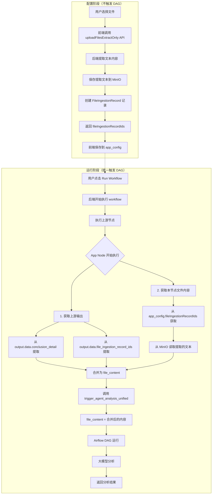
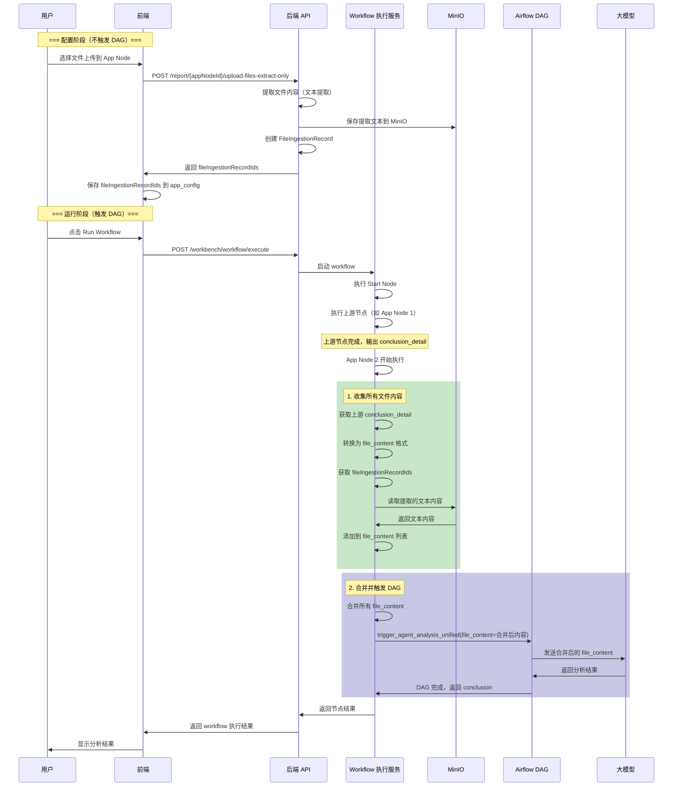
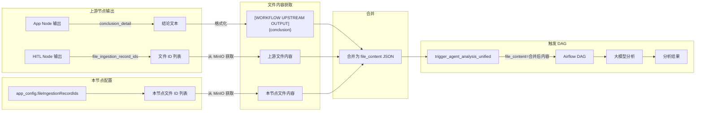

# App Node 链式调用业务场景澄清

> **重要更新 (2026-01-25)**: 重构了 App Node 的执行模式，支持链式调用场景中上游输出与本节点文件的合并后统一触发 DAG。

## 一、业务场景概述

### 1.1 App Node 的三种执行模式

App Node 支持三种数据输入模式，根据数据来源和配置决定：

1. **URL 模式**：从 URL 路径读取文件
2. **File 模式**：使用前端已上传的文件（新设计：保存到 FileIngestionRecord，workflow 运行时触发 DAG）
3. **Chain Call 模式**：使用上游节点的输出数据（链式调用）

**关键变化**：
- **旧设计**：File 模式下，前端上传文件时立即触发 DAG，获得 `dagRunId`
- **新设计**：File 模式下，前端上传文件时只提取文本保存到 MinIO，返回 `fileIngestionRecordIds`，DAG 在 workflow 运行时统一触发

---

## 二、完整数据流详细流程图

### 2.1 新设计的整体架构



---

### 2.2 数据流详细图（Sequence Diagram）



---

### 2.3 文件内容处理流程图



---

## 三、三种模式的详细说明

### 3.1 URL 模式

**触发条件**：
- `app_config.inputMode == 'url'`
- `app_config.url` 存在

**执行流程**：
```
用户配置 URL → App Node 执行
  ↓
如果有上游数据：
  - 提取上游 conclusion_detail/file_ingestion_record_ids
  - 转换为 file_content 格式
  - 与 URL 文件一起发送给 DAG
如果没有上游数据：
  - 只使用 folder_path 触发 DAG
  ↓
调用 trigger_agent_analysis_unified
  ↓
等待 DAG 完成
  ↓
返回分析结果
```

---

### 3.2 File 模式（新设计）

**配置阶段（前端）**：
- 用户选择文件
- 调用 `uploadFilesExtractOnly` API
- 后端提取文本，保存到 MinIO，创建 `FileIngestionRecord`
- 返回 `fileIngestionRecordIds`
- 前端保存到 `app_config.fileIngestionRecordIds`

**运行阶段（后端）**：
```
Workflow 运行 → App Node 开始执行
  ↓
1. 收集上游数据（如果有）：
   - 从上游 output.data.conclusion_detail 提取
   - 从上游 output.data.file_ingestion_record_ids 提取文件内容
   - 转换为 file_content 格式
  ↓
2. 收集本节点文件内容：
   - 从 app_config.fileIngestionRecordIds 获取文件 ID 列表
   - 从 MinIO 读取提取的文本内容
  ↓
3. 合并所有内容为 file_content
  ↓
4. 调用 trigger_agent_analysis_unified(file_content=合并后内容)
  ↓
5. 等待 DAG 完成
  ↓
6. 返回分析结果
```

**关键点**：
- DAG 在 workflow 运行时才触发，不是在文件上传时
- 上游数据和本节点文件内容合并后一起分析
- 支持链式调用场景

---

### 3.3 Chain Call 模式（链式调用）

**触发条件**：
- 有上游节点（`previous_nodes` 不为空）
- 上游节点有可用数据（`file_ingestion_record_ids` 或 `conclusion_detail`）

**数据流**：
```
上游节点 output.data
  ├─ file_ingestion_record_ids → 从 MinIO 获取文件内容
  └─ conclusion_detail → 格式化为 [WORKFLOW UPSTREAM OUTPUT] markdown
  ↓
合并为 file_content JSON
  ↓
与本节点文件内容（如果有）合并
  ↓
trigger_agent_analysis_unified(file_content=...) → DAG → 大模型分析
```

---

## 四、具体业务场景示例

### 场景 1：App Node → App Node（结论传递）

**Workflow 结构**：
```
Start → App Node 1 (URL/File) → App Node 2 (Chain Call)
```

**执行流程**：
1. **App Node 1** 执行：
   - 使用 URL 或 File 模式触发 DAG
   - 获得分析结果 `conclusion_detail`

2. **App Node 2** 执行（Chain Call 模式）：
   - 检测到上游节点 App Node 1
   - 提取 `output.data.conclusion_detail`
   - 格式化为 `file_content`：
     ```json
     [{
       "file_name": "workflow_upstream_output.md",
       "file_content": "[WORKFLOW UPSTREAM OUTPUT]\n\n{conclusion_detail}"
     }]
     ```
   - 如果本节点也有文件，合并：
     ```json
     [
       {"file_name": "workflow_upstream_output.md", "file_content": "..."},
       {"file_name": "local_file.pdf", "file_content": "..."}
     ]
     ```
   - 调用 `trigger_agent_analysis_unified(file_content=合并后内容)`
   - 触发新的 DAG，大模型统一分析
   - 返回新的分析结果

---

### 场景 2：HITL (request_for_update) → App Node（文件传递）

**Workflow 结构**：
```
Start → App Node 1 → Question Classifier → HITL (request_for_update) → App Node 2
```

**执行流程**：
1. **HITL (request_for_update)** 执行：
   - 用户上传文件
   - 文件保存到 MinIO
   - 输出 `file_ingestion_record_ids: [123, 456]`

2. **App Node 2** 执行（Chain Call 模式）：
   - 检测到上游节点 HITL
   - 提取 `output.data.file_ingestion_record_ids: [123, 456]`
   - 从 MinIO 获取文件内容
   - 如果本节点也有文件，合并
   - 调用 `trigger_agent_analysis_unified(file_content=合并后内容)`
   - 触发新的 DAG，大模型分析所有文件
   - 返回分析结果

---

### 场景 3：App Node → HITL → App Node（混合场景）

**Workflow 结构**：
```
Start → App Node 1 → HITL (request_for_update) → App Node 2
```

**执行流程**：
1. **App Node 1** 执行：
   - 使用 URL 模式触发 DAG
   - 获得分析结果 `conclusion_detail`

2. **HITL (request_for_update)** 执行：
   - 接收 App Node 1 的结论（作为上下文展示给用户）
   - 用户上传补充文件
   - 输出 `file_ingestion_record_ids: [789]`

3. **App Node 2** 执行（Chain Call 模式）：
   - 检测到上游节点 HITL
   - 提取 `output.data.file_ingestion_record_ids: [789]`
   - 从 MinIO 获取文件内容
   - 如果本节点也有文件，合并
   - 调用 `trigger_agent_analysis_unified(file_content=合并后内容)`
   - 触发新的 DAG，大模型分析上传的文件
   - 返回分析结果

---

## 五、API 和数据结构

### 5.1 新增后端 API

**POST /report/{app_node_id}/upload-files-extract-only**

功能：上传文件并提取文本，**不触发 DAG**

请求：
```
Content-Type: multipart/form-data

files: File[]  # 文件列表
requirement: string  # 可选，分析要求
```

响应：
```json
{
  "success": true,
  "message": "File processing completed: 2 successful, 0 failed",
  "files_info": [
    {
      "filename": "supplier_info.pdf",
      "size": 102400,
      "text_extracted": true,
      "status": "success",
      "text_length": 5000,
      "file_ingestion_record_id": 123
    }
  ],
  "app_node_id": 105,
  "file_ingestion_record_ids": [123, 124],
  "total_files": 2,
  "successful_files": 2,
  "failed_files": 0
}
```

---

### 5.2 新增前端类型

```typescript
// 前端 executionState 类型更新
executionState?: {
  requirement?: string
  inputMode?: 'url' | 'file'
  url?: string
  files?: File[]
  status: 'idle' | 'running' | 'completed' | 'failed' | 'partial_success' | 'extracted'
  dagRunId?: string  // Legacy: for backward compatibility
  fileIngestionRecordIds?: number[]  // NEW: file record IDs
  markdownResult?: string
  error?: string
}
```

---

### 5.3 app_config 结构变化

**旧结构（File 模式）**：
```json
{
  "inputMode": "file",
  "dagRunId": "manual__2026-01-25T...",
  "requirement": "...",
  "appNodeId": 105
}
```

**新结构（File 模式）**：
```json
{
  "inputMode": "file",
  "fileIngestionRecordIds": [123, 124],
  "requirement": "...",
  "appNodeId": 105
}
```

---

## 六、代码修改清单

### 6.1 后端修改

| 文件 | 修改内容 |
|-----|---------|
| `backend/app/api/v1/report.py` | 新增 `upload_files_extract_only` API |
| `backend/app/schemas.py` | 新增 `ReportFilesExtractOnlyResponse` 类型 |
| `backend/app/services/workflow/workflow_execution_service.py` | 重构 App Node 执行逻辑，支持合并后触发 DAG |

### 6.2 前端修改

| 文件 | 修改内容 |
|-----|---------|
| `frontend/src/services/reportService.ts` | 新增 `uploadFilesExtractOnly` 方法和类型 |
| `frontend/src/components/Workbench/FlowWorkspace.tsx` | 使用新 API，保存 `fileIngestionRecordIds` |
| `frontend/src/components/Workbench/FlowNodes/ApplicationNode.tsx` | 更新 `executionState` 类型 |

---

## 七、向后兼容性

### 7.1 兼容策略

- **旧 workflow**（使用 `dagRunId`）：继续支持，后端会检查并使用已有的 `dagRunId`
- **新 workflow**（使用 `fileIngestionRecordIds`）：使用新的合并逻辑

### 7.2 后端兼容代码

```python
if input_mode == 'file':
    if not all_file_contents:
        # No files from FileIngestionRecord and no upstream data
        # Fall back to old behavior (dagRunId) for backward compatibility
        dag_run_id = local_app_config.get('dagRunId')
        if not dag_run_id:
            raise ValueError("No file content available")
    else:
        # NEW: Trigger DAG with merged file_content
        merged_file_content = json.dumps(all_file_contents, ensure_ascii=False)
        dag_run_id = await trigger_agent_analysis_unified(...)
```

---

## 八、关键设计原则

1. **配置和数据分离**：`app_config` 是配置，`file_content` 是数据
2. **延迟触发 DAG**：DAG 在 workflow 运行时才触发，不是在文件上传时
3. **统一分析**：上游数据 + 本节点文件内容合并后一起发送给大模型
4. **上游数据优先**：合并时，上游数据放在前面
5. **向后兼容**：支持旧的 `dagRunId` 模式

---

## 九、测试建议

1. **File 模式测试**：
   - 上传文件 → 检查 `fileIngestionRecordIds` 是否正确保存
   - 运行 workflow → 检查 DAG 是否正确触发
   - 检查分析结果是否包含上传的文件内容

2. **链式调用测试**：
   - App Node 1 → App Node 2：检查 `conclusion_detail` 是否正确传递
   - HITL → App Node：检查 `file_ingestion_record_ids` 是否正确传递
   - 混合场景：检查所有内容是否正确合并

3. **向后兼容测试**：
   - 使用旧的 `dagRunId` 运行 workflow → 检查是否正常工作
