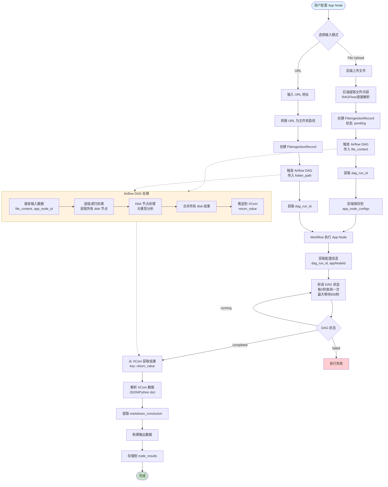
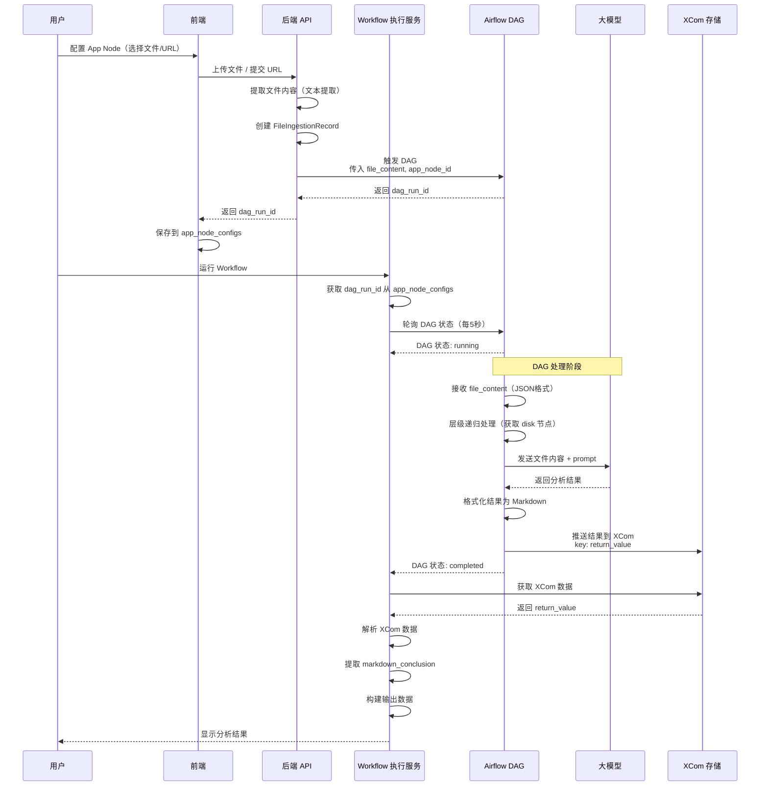
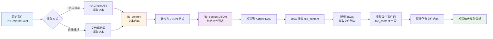
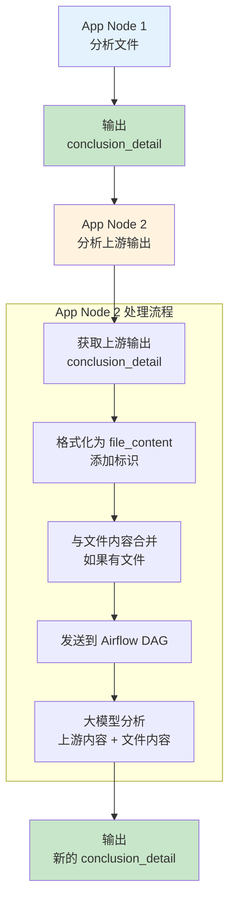

# App Node 完整流程详解

## 概述

本文档详细说明 App Node（应用节点）的完整执行流程，包括文件上传、Airflow DAG 处理、大模型分析和结果返回的全过程。旨在帮助理解整个数据流，为后续支持链式 App Node 提供基础。

---

## 一、App Node 是什么？

**App Node（应用节点）** 是 Workflow 中的一个特殊节点，用于执行**文件分析任务**。它的核心功能是：

1. **接收文件或 URL 作为输入**
2. **将文件内容发送到 Airflow DAG 进行处理**
3. **使用大模型（LLM）分析文件内容**
4. **返回 Markdown 格式的分析报告**

### 1.1 关键概念

**光盘（Disk）**:
- App Node 内部包含多个**光盘（disk）**，每个光盘是一个分析单元
- 每个光盘有自己的 `prompt`（分析提示词），用于指导大模型分析
- 光盘可以按层级组织（app 节点包含多个 disk 节点）
- **重要**: 光盘（disk）是**写死的、固定的**，不在 UI 配置界面让用户选择。app_node_id 是在创建 App Node 时就已经确定的（从 node.data.appNodeId 获取）

**文件内容（file_content）**:
- 文件上传后，需要提取文本内容
- 提取后的文本内容存储在 `file_content` 字段中
- 格式为 JSON 字符串，包含文件列表：
  ```json
  [
    {
      "file_name": "文件1.docx",
      "file_content": "文件1的文本内容..."
    }
  ]
  ```

**DAG 运行ID（dag_run_id）**:
- 每次触发 Airflow DAG 时，会生成一个唯一的 `dag_run_id`
- 用于追踪 DAG 的执行状态和获取结果
- 格式：`manual__2026-01-23T10:15:44.004835+00:00`

**XCom（Cross-Communication）**:
- Airflow 中用于任务间数据传递的机制
- App Node 的结果存储在 XCom 的 `return_value` 中
- 包含 `markdown_conclusion` 字段（大模型生成的分析报告）

---

## 二、完整流程图

### 2.1 整体流程图（Mermaid）

┌──────────────────────┐
│        用户          │
│   配置 App Node     │
└─────────┬────────────┘
          │
          ▼
┌──────────────────────┐
│   选择输入方式       │
│  - 上传文件          │
│  - 输入 URL          │
└─────────┬────────────┘
          │
   ┌──────┴───────────┐
   │                  │
   ▼                  ▼
┌────────────────┐   ┌────────────────────┐
│ 前端上传文件   │   │  输入 URL 地址     │
└──────┬─────────┘   └─────────┬──────────┘
       │                         │
       ▼                         ▼
┌────────────────────┐   ┌────────────────────┐
│ 后端提取文件内容   │   │ URL 转换为          │
│ RAGFlow / 解析器   │   │ 文件夹路径          │
└──────┬─────────────┘   └─────────┬──────────┘
       │                         │
       └─────────┬───────────────┘
                 ▼
┌────────────────────────────────┐
│ 创建 FileIngestionRecord        │
│ 状态：pending                   │
└─────────┬──────────────────────┘
          │
          ▼
┌────────────────────────────────┐
│ 触发 Airflow DAG                │
│ - 传入文件内容 / 文件路径       │
│ - 返回 dag_run_id               │
└─────────┬──────────────────────┘
          │
          ▼
┌────────────────────────────────┐
│ 保存 dag_run_id 到              │
│ app_node_configs                │
└─────────┬──────────────────────┘
          │
          ▼
┌──────────────────────┐
│   运行 Workflow     │
└─────────┬────────────┘
          │
          ▼
┌────────────────────────────────┐
│ 轮询 Airflow DAG 状态           │
│ 每 5 秒一次，最多 600 秒        │
└─────────┬──────────────────────┘
          │
          ▼
┌──────────────────────┐
│   DAG 状态判断       │
└───────┬────────┬─────┘
        │        │
     running   completed
        │        ▼
        │   ┌──────────────────────┐
        │   │ 从 XCom 获取结果     │
        │   │ return_value         │
        │   └─────────┬────────────┘
        │             ▼
        │   ┌──────────────────────┐
        │   │ 解析结果，提取       │
        │   │ markdown_conclusion  │
        │   └─────────┬────────────┘
        │             ▼
        │   ┌──────────────────────┐
        │   │ 构建 App Node 输出   │
        │   │ 存储 node_results   │
        │   └─────────┬────────────┘
        │             ▼
        │   ┌──────────────┐
        │   │    完成      │
        │   └──────────────┘
        │
        ▼
┌──────────────────────┐
│   继续等待 / 失败   │
└──────────────────────┘




### 2.2 数据流详细图
用户
 │
 ▼
前端
 │  上传文件 / 提交 URL
 ▼
后端 API
 │
 │ ① 提取文件文本
 │ ② 创建 FileIngestionRecord
 │
 ▼
Airflow DAG
 │
 │ 处理文件结构
 │ 调用大模型分析
 │
 ▼
XCom（结果存储）
 │
 ▼
Workflow 执行服务
 │
 │ 轮询 DAG
 │ 解析 XCom
 │
 ▼
用户看到分析结果




### 2.3 文件内容处理流程图

┌────────────────────┐
│ 原始文件           │
│ PDF / Word / Excel │
└─────────┬──────────┘
          │
          ▼
┌────────────────────┐
│ 选择文本提取方式   │
│ - RAGFlow           │
│ - 文档解析器       │
└───────┬────────────┘
        │
        ▼
┌────────────────────┐
│ 提取文本内容       │
│ file_content       │
└─────────┬──────────┘
          │
          ▼
┌────────────────────┐
│ 转换为 JSON 格式   │
│ 支持多个文件       │
└─────────┬──────────┘
          │
          ▼
┌────────────────────┐
│ 发送到 Airflow DAG │
└─────────┬──────────┘
          │
          ▼
┌────────────────────┐
│ DAG 解析 JSON      │
│ 获取文件列表       │
└─────────┬──────────┘
          │
          ▼
┌────────────────────┐
│ 拼接所有文件内容   │
└─────────┬──────────┘
          │
          ▼
┌────────────────────┐
│ 发送给大模型分析   │
└────────────────────┘




---

## 三、详细数据流

### 3.1 文件上传阶段（File Upload 模式）

#### 前端操作
1. 用户在 Workflow 画布上配置 App Node
2. 选择输入模式：**File Upload**
3. **注意**: 光盘（disk）是**写死的、固定的**，不在 UI 中让用户选择。app_node_id 是从节点创建时就已经确定的（node.data.appNodeId）
4. 上传文件（支持单个或多个文件）
5. 填写分析需求（requirement，可选）

#### 后端处理（`backend/app/api/v1/report.py`）

**API 端点**: `POST /api/v1/report/{disk_id}/upload-file`

**处理流程**:
```python
1. 接收上传的文件
   - 文件对象（UploadFile）
   - requirement（分析需求文本）

2. 创建 FileIngestionRecord
   - file_name: 文件名
   - file_hash: 文件哈希值（SHA256）
   - source: "report_disk"
   - status: "pending"
   - uploaded_by: 用户ID

3. 提取文件内容
   - 使用 RAGFlow 或直接解析（PDF、Word、Excel等）
   - 提取后的文本内容存储在 extracted_text 字段
   - 如果提取失败，使用原始文件内容（限制大小）

4. 触发 Airflow DAG
   - 调用 trigger_agent_analysis_unified()
   - 传入参数：
     * app_node_id: disk_id（光盘ID）
     * filename: 文件名
     * file_content: 提取的文本内容（或原始内容）
     * requirement: 分析需求
     * file_ingestion_record_id: 文件记录ID

5. 获取 dag_run_id
   - 从 Airflow API 响应中获取 dag_run_id
   - 更新 FileIngestionRecord：
     * dag_run_id: 保存 DAG 运行ID
     * status: "running"

6. 返回结果给前端
   - success: true
   - dag_run_id: DAG 运行ID（前端保存到 app_node_configs）
   - file_info: 文件信息
```

---

### 3.2 URL 模式处理

#### 前端操作
1. 选择输入模式：**URL**
2. 输入 URL 地址（如：`http://localhost:8083/filebrowser/files/...`）
3. **注意**: 光盘（disk）是**写死的、固定的**，不在 UI 中让用户选择。app_node_id 是从节点创建时就已经确定的（node.data.appNodeId）
4. 填写分析需求（requirement，可选）

#### 后端处理（`backend/app/services/workflow/workflow_execution_service.py`）

**方法**: `_call_process_url_api()`

**处理流程**:
```python
1. 转换 URL 为文件夹路径
   - 调用 convert_url_to_folder_path()
   - 例如：http://localhost:8083/filebrowser/files/xxx/
   - 转换为：/srv/filebrowser/files/xxx/

2. 创建 FileIngestionRecord
   - file_name: "url_{url_hash[:16]}"
   - file_hash: URL 的 SHA256 哈希值
   - source: "report_disk"
   - status: "pending"

3. 触发 Airflow DAG
   - 调用 trigger_agent_analysis_unified()
   - 传入参数：
     * app_node_id: app_node_id
     * folder_path: 转换后的文件夹路径
     * requirement: 分析需求
     * file_ingestion_record_id: 文件记录ID

4. 获取 dag_run_id
   - 更新 FileIngestionRecord：
     * dag_run_id: 保存 DAG 运行ID
     * status: "running"

5. 返回 dag_run_id
   - 供 Workflow 执行使用
```

---

### 3.3 Workflow 执行阶段

#### App Node 执行（`backend/app/services/workflow/workflow_execution_service.py`）

**方法**: `_create_app_node()`

**处理流程**:
```python
1. 获取配置信息
   - 从 app_node_configs 获取：
     * dag_run_id: DAG 运行ID（File Upload 模式）
     * inputMode: "file" 或 "url"
     * requirement: 分析需求
     * appNodeId: 光盘ID

2. 如果是 URL 模式，触发 DAG
   - 调用 _call_process_url_api()
   - 获取 dag_run_id

3. 轮询 DAG 状态
   - 调用 _poll_dag_status()
   - 每 5 秒查询一次 DAG 运行状态
   - 最大等待时间：600 秒（10 分钟）
   - 等待 DAG 状态变为 completed

4. 从 XCom 获取结果
   - 调用 _get_standard_mode_dag_status()
   - 从 Airflow XCom 获取分析结果
   - XCom key: return_value
   - 解析 XCom 数据（支持 JSON 和 Python dict 格式）

5. 提取 markdown_conclusion
   - 从 XCom 结果中提取 markdown_conclusion 字段
   - 这是大模型生成的分析报告（Markdown 格式）

6. 构建输出数据
   - output.data.conclusion_detail: markdown_conclusion
   - output.data.dag_run_id: dag_run_id
   - output.structured_output: 结构化数据

7. 存储到 node_results
   - 保存完整的节点执行结果
   - 供下游节点使用
```

---

### 3.4 Airflow DAG 处理阶段

#### DAG 配置（`airflow/dags/agent_file_ingest_unified.py`）

**DAG ID**: `agent_file_ingest_unified`

**Task**: `stage_1_base_agents`

#### 处理流程

**1. 接收输入数据**
```python
json_data = {
    "app_node_id": 105,  # 光盘ID
    "file_content": "[{\"file_name\": \"文件1.docx\", \"file_content\": \"文件内容...\"}]",  # JSON字符串
    "requirement": "分析需求文本",
    "file_ingestion_record_id": 123,
    "enable_history_operations": True,
    "need_extract_5w": False
}
```

**2. 层级递归处理（使用 app_node_id）**
```python
# 使用 AppHierarchyProcessor 处理
processor = AppHierarchyProcessor(DB_CONFIG)

# 递归处理所有子节点
result = processor.process_node_with_children(
    app_node_id=app_node_id,
    json_data=json_data,
    enable_history_operations=True,
    need_extract_5w=False,
    user_id=user_id
)
```

**3. Disk 节点处理（大模型分析）**

对于每个 disk 节点：

```python
# 获取 disk 配置
disk = get_disk_by_id(disk_id)
prompt = disk.prompt  # 分析提示词

# 准备输入数据
input_text = file_content  # 文件内容

# 调用大模型分析
llm_result = await call_llm(
    prompt=prompt,
    input_text=input_text,
    requirement=requirement
)

# 格式化分析结果
markdown_result = format_to_markdown(llm_result)
```

**4. 合并所有 disk 的分析结果**

```python
# 将所有子节点的分析结果合并
all_results = []
for disk_result in disk_results:
    all_results.append(disk_result.markdown)

# 生成最终的 markdown_conclusion
markdown_conclusion = "\n\n---\n\n".join(all_results)
```

**5. 存储结果到 XCom**

```python
# 推送到 XCom
return_value = {
    "success": True,
    "markdown_conclusion": markdown_conclusion,  # 完整的分析报告（Markdown格式）
    "processing_mode": "single",  # 或 "multiple"
    "node_type": "app",
    "node_id": app_node_id,
    "node_name": "光盘名称",
    "timestamp": "2026-01-23T10:15:44.004835+00:00"
}

# 推送到 XCom（Airflow 自动处理）
return return_value
```

---

## 四、关键数据结构

### 4.1 文件内容格式（file_content）

**JSON 字符串格式**:
```json
[
  {
    "file_name": "文件1.docx",
    "file_content": "文件1的文本内容..."
  },
  {
    "file_name": "文件2.pdf",
    "file_content": "文件2的文本内容..."
  }
]
```

**说明**:
- `file_name`: 文件名
- `file_content`: 文件的文本内容（已提取）

---

### 4.2 XCom 返回数据格式

**存储在 XCom 的 return_value**:
```python
{
    "success": True,
    "markdown_conclusion": "完整的分析报告（Markdown格式）",
    "processing_mode": "single",  # 或 "multiple"
    "node_type": "app",
    "node_id": 105,
    "node_name": "光盘名称",
    "timestamp": "2026-01-23T10:15:44.004835+00:00"
}
```

**说明**:
- `markdown_conclusion`: 大模型生成的分析报告（Markdown 格式）
- `processing_mode`: 处理模式（single: 单文件，multiple: 多文件）

---

### 4.3 App Node 输出数据格式

**存储在 node_results[app_node_id]**:
```python
{
    "status": "completed",
    "input": {
        "data": {},  # 通常为空（App Node 主要使用 app_node_configs）
        "source_node_id": "start-2",
        "source_type": "upstream"  # 或 "workflow_input" 或 "config"
    },
    "operation": {
        "type": "app_execution",
        "description": "Execute app analysis (app_node_id=105)",
        "config": {
            "appNodeId": 105,
            "inputMode": "file",  # 或 "url"
            "requirement": "分析需求文本"
        },
        "duration_ms": 503736  # 执行耗时（毫秒）
    },
    "output": {
        "data": {
            "conclusion_detail": "完整的分析报告（Markdown格式）",
            "dag_run_id": "manual__2026-01-23T10:15:44.004835+00:00"
        },
        "structured_output": {
            "node_type": "app",
            "app_node_id": 105,
            "conclusion_length": 8323,
            "dag_run_id": "manual__2026-01-23T10:15:44.004835+00:00",
            "execution_status": "success",
            "has_conclusion": True
        }
    },
    "timeline": {
        "executed_at": "2026-01-23T10:24:08.378502+00:00",
        "execution_order": 2
    }
}
```

---

## 五、关键代码位置

### 5.1 文件上传
- **前端**: `frontend/src/components/Workbench/FlowNodes/ApplicationNode.tsx`
- **后端 API**: `backend/app/api/v1/report.py:upload_report_file()`
- **触发 DAG**: `backend/app/api/v1/report.py:trigger_agent_analysis_unified()`

### 5.2 Workflow 执行
- **App Node 执行**: `backend/app/services/workflow/workflow_execution_service.py:_create_app_node()`
- **轮询 DAG 状态**: `backend/app/services/workflow/workflow_execution_service.py:_poll_dag_status()`
- **获取 DAG 结果**: `backend/app/api/v1/report.py:_get_standard_mode_dag_status()`

### 5.3 Airflow DAG
- **DAG 定义**: `airflow/dags/agent_file_ingest_unified.py`
- **Task 处理**: `airflow/dags/agent_file_ingest_unified.py:stage_1_base_agents()`
- **层级处理**: `airflow/dags/agent_flows/app_hierarchy_processor.py`
- **大模型分析**: `airflow/dags/agent_flows/process_file_main_new_version.py`

### 5.4 XCom 数据获取
- **XCom 服务**: `backend/app/services/airflow_service.py:get_xcom_value()`
- **XCom 解析**: `backend/app/api/v1/report.py:_process_standard_dag_status()`

---

## 六、UI 预览图说明

### 6.1 配置 App Node

```
┌─────────────────────────────────────────┐
│  App Node 配置                          │
├─────────────────────────────────────────┤
│                                         │
│  输入模式: ○ File Upload  ● URL        │
│                                         │
│  URL 地址:                              │
│  ┌───────────────────────────────────┐ │
│  │ http://localhost:8083/...        │ │
│  └───────────────────────────────────┘ │
│                                         │
│  注意: 光盘（disk）是写死的、固定的，   │
│  不在 UI 中让用户选择                   │
│                                         │
│  分析需求:                              │
│  ┌───────────────────────────────────┐ │
│  │ 请输入分析需求...                 │ │
│  └───────────────────────────────────┘ │
│                                         │
│  [保存配置]  [取消]                     │
└─────────────────────────────────────────┘
```

### 6.2 文件上传（File Upload 模式）

```
┌─────────────────────────────────────────┐
│  上传文件                                │
├─────────────────────────────────────────┤
│                                         │
│  ┌───────────────────────────────────┐ │
│  │  拖拽文件到此处或点击选择文件      │ │
│  │                                    │ │
│  │  📄 document.pdf                    │ │
│  │  📄 report.docx                    │ │
│  └───────────────────────────────────┘ │
│                                         │
│  状态: ✅ 上传成功                       │
│  DAG Run ID: manual__2026-01-23...     │
│                                         │
│  [开始分析]                             │
└─────────────────────────────────────────┘
```

### 6.3 执行结果展示

```
┌─────────────────────────────────────────┐
│  App Node 执行结果                       │
├─────────────────────────────────────────┤
│                                         │
│  状态: ✅ 已完成                         │
│  执行时间: 503.7 秒                      │
│                                         │
│  输出内容:                               │
│  ┌───────────────────────────────────┐ │
│  │ ## Executive Summary              │ │
│  │                                    │ │
│  │ - Material ID: 321                 │ │
│  │ - Supplier: SUP-B-001              │ │
│  │ - High-level conclusion: ...       │ │
│  │                                    │ │
│  │ ## Key Findings                    │ │
│  │ ...                                │ │
│  └───────────────────────────────────┘ │
│                                         │
│  [查看完整报告]                          │
└─────────────────────────────────────────┘
```

---

## 七、支持链式调用的设计思路

### 7.1 链式调用场景

**支持的链式调用场景**:
1. **App Node → App Node**: 第二个 App Node 使用第一个的输出进行进一步分析
2. **App Node → Question Classifier Node → Human In The Loop Node → App Node**: 复杂的业务场景
3. **Human In The Loop Node (request_for_update) → Human In The Loop Node (approval)**: 文件上传后审批
4. **其他任意组合**: 支持任意节点类型的链式调用

### 7.2 当前限制

**问题**: 节点无法使用上游节点的输出作为输入

**原因**:
- App Node 只支持 `file` 和 `url` 两种输入模式
- Question Classifier Node 无法从 App Node 的新结构获取 conclusion_detail
- Human In The Loop Node 无法从上游节点获取文件ID（file_ingestion_record_ids）
- 即使 `input.data` 包含上游数据，也不会被使用

### 7.3 设计方案

**目标**: 支持任意节点类型的链式调用

**核心思路**:
1. **统一的数据提取服务**: 所有节点都从上游节点的 `output.data` 提取数据
2. **数据格式转换**: 根据当前节点类型，将上游数据转换为需要的格式
3. **数据合并策略**: 如果节点需要文件内容，将上游数据与文件内容合并

**详细设计**: 请参考 `workflow-chain-call-design.md`

**关键点**:
1. **统一的数据提取服务**: 所有节点都从上游节点的 `output.data` 提取数据
2. **数据格式转换**: 根据当前节点类型，将上游数据转换为需要的格式
3. **支持任意节点类型**: 不仅支持 App Node 链式调用，还支持：
   - App Node → Question Classifier Node → Human In The Loop Node → App Node
   - Human In The Loop Node (request_for_update) → Human In The Loop Node (approval)
   - 其他任意组合

### 7.3 链式 App Node 流程图

┌────────────────────┐
│ App Node 1         │
│ 分析文件           │
└─────────┬──────────┘
          │
          ▼
┌────────────────────┐
│ 输出分析结论       │
│ conclusion_detail  │
└─────────┬──────────┘
          │
          ▼
┌────────────────────┐
│ App Node 2         │
│ 二次分析           │
└─────────┬──────────┘
          │
          ▼
┌────────────────────────────┐
│ 合并输入内容               │
│ - 上游结论                 │
│ - 当前节点文件内容         │
└─────────┬──────────────────┘
          │
          ▼
┌────────────────────┐
│ 发送到 Airflow DAG │
└─────────┬──────────┘
          │
          ▼
┌────────────────────┐
│ 大模型综合分析     │
└─────────┬──────────┘
          │
          ▼
┌────────────────────┐
│ 输出新的结论       │
└────────────────────┘




### 7.4 数据拼接示例

**场景**: App Node 1 → App Node 2

**App Node 1 输出**:
```json
{
  "output": {
    "data": {
      "conclusion_detail": "## Executive Summary\n- Material ID: 321\n- Supplier: SUP-B-001\n..."
    }
  }
}
```

**App Node 2 处理**:
```python
# 1. 提取上游内容
upstream_content = "## Executive Summary\n- Material ID: 321\n- Supplier: SUP-B-001\n..."

# 2. 格式化为 file_content 格式
workflow_file = {
    "file_name": "workflow_upstream_output.md",
    "file_content": "[WORKFLOW UPSTREAM OUTPUT]\n\n## Executive Summary\n- Material ID: 321\n- Supplier: SUP-B-001\n..."
}

# 3. 如果有文件，合并；如果没有文件，只使用上游内容
if file_content:
    files = json.loads(file_content)
    files.insert(0, workflow_file)  # 上游内容放在最前面
    combined_content = json.dumps(files, ensure_ascii=False)
else:
    combined_content = json.dumps([workflow_file], ensure_ascii=False)

# 4. 发送到 Airflow DAG
# combined_content 包含：
# [
#   {
#     "file_name": "workflow_upstream_output.md",
#     "file_content": "[WORKFLOW UPSTREAM OUTPUT]\n\n..."
#   },
#   {
#     "file_name": "原始文件.pdf",
#     "file_content": "原始文件内容..."
#   }
# ]
```

**大模型分析时**:
- 会同时看到上游节点的输出和原始文件内容
- 可以基于上游分析结果进行进一步分析

---

## 八、常见问题解答

### 8.1 为什么文件上传后需要等待？

**答**: 文件上传后，需要经过以下步骤：
1. 提取文件内容（文本提取）
2. 触发 Airflow DAG
3. DAG 执行大模型分析（可能需要几分钟）
4. 从 XCom 获取结果

因此，App Node 的执行是**异步**的，需要轮询 DAG 状态直到完成。

### 8.2 文件内容是如何提取的？

**答**: 文件内容提取有两种方式：
1. **RAGFlow API**: 用于复杂文件格式（PDF、Word、Excel等）
2. **直接解析**: 用于简单文本文件

提取后的文本内容存储在 `file_content` 字段中，供大模型分析使用。

### 8.3 大模型是如何分析文件的？

**答**: 
1. 每个光盘（disk）有自己的 `prompt`（分析提示词）
2. 将文件内容 + prompt + requirement 发送给大模型
3. 大模型根据 prompt 分析文件内容，生成分析结果
4. 分析结果格式化为 Markdown 格式

### 8.4 为什么需要 XCom？

**答**: 
- Airflow DAG 是独立的任务执行系统
- Workflow 需要从 Airflow 获取分析结果
- XCom 是 Airflow 提供的任务间数据传递机制
- 通过 XCom，Workflow 可以获取 DAG 的执行结果

### 8.5 链式 App Node 如何工作？

**答**: （待实现）
1. 第二个 App Node 从第一个 App Node 的 `output.data.conclusion_detail` 获取内容
2. 将上游内容格式化为 `file_content` 格式（添加标识）
3. 与文件内容（如果有）合并
4. 一起发送给大模型分析

---

## 九、总结

### 9.1 核心流程

1. **文件上传** → 创建 FileIngestionRecord → 提取文件内容 → 触发 Airflow DAG
2. **Workflow 执行** → 轮询 DAG 状态 → 从 XCom 获取结果 → 提取 markdown_conclusion
3. **Airflow DAG** → 接收文件内容 → 层级递归处理 → 大模型分析 → 生成 markdown_conclusion → 存储到 XCom

### 9.2 关键数据

- **file_content**: JSON 字符串，包含文件列表（每个文件包含 file_name 和 file_content）
- **markdown_conclusion**: 大模型生成的分析报告（Markdown 格式）
- **dag_run_id**: DAG 运行ID，用于追踪任务执行状态

### 9.3 下一步

- 实现链式 App Node 支持
- 将上游节点的输出转换为 file_content 格式
- 与文件内容拼接，一起送入大模型分析

### 9.4 相关文档

- `workflow-nodes-complete-output-structure.md` - 节点输出结构说明
- `workflow-app-node-input-data-clarification.md` - App Node 输入数据澄清
- `workflow-input-data-empty-analysis.md` - input.data 为空问题分析
