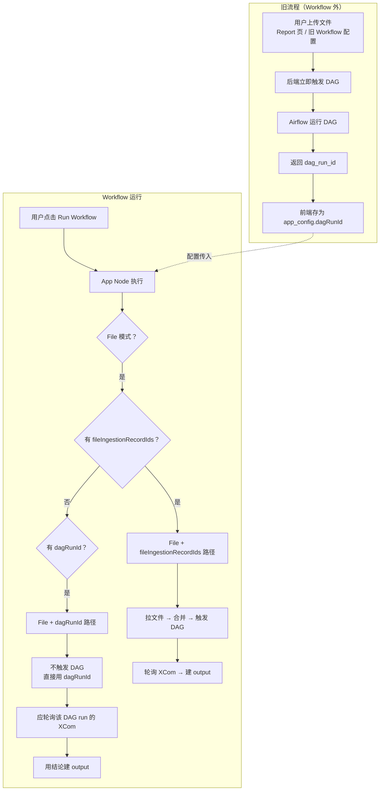
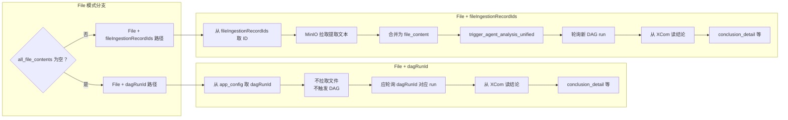

# App Node 「File + dagRunId」回溯兼容路径说明

> 面向小白：澄清 **File 模式 + dagRunId** 这条「旧逻辑 / 回溯兼容路径」的业务含义、数据流与文件处理流程。

---

## 一、一句话业务逻辑

**「File + dagRunId」** = **File 模式**下，**没有** `fileIngestionRecordIds`（本节点没有通过「仅提取」上传的文件），而是由用户/前端传入一个 **已存在的 DAG 运行 ID**（`dagRunId`）。  
App Node **不再触发新的 DAG**，只 **复用** 这个已有 DAG 运行，理论上应 **轮询该 run 的 XCom 拿分析结果**，再往下游传。

---

## 二、和「File + fileIngestionRecordIds」的区别（先建立直觉）

| 对比项 | **File + fileIngestionRecordIds**（新设计） | **File + dagRunId**（回溯兼容） |
|--------|---------------------------------------------|----------------------------------|
| **文件从哪来** | Workbench 里选文件 → 调「仅提取」API → 存 MinIO，拿 `fileIngestionRecordIds` | **不通过 Workflow 上传**。文件在 **别处** 上传（如旧版 Report 上传页） |
| **DAG 谁触发** | **Workflow 跑 App Node 时** 我们触发 DAG，把合并后的 `file_content` 传过去 | **上传时** 旧接口已经触发过 DAG，我们 **不触发** |
| **dag_run_id 从哪来** | 我们 `trigger_agent_analysis_unified` 后拿到 | 旧流程返回的 `dag_run_id`，前端存成 `dagRunId` 塞进 `app_config` |
| **App Node 拿到什么** | `fileIngestionRecordIds` → 我们拉文件内容 → 合并 → 触发 DAG | 只有 `dagRunId`，没有文件 ID、也没有在本流程里拉文件内容 |
| **我们应该做什么** | 触发 DAG → **轮询** 状态/XCom → 用结论建 output | **不触发**，直接拿 `dagRunId` → **轮询** 该 run 的 XCom → 用结论建 output |

所以：**两种都是 File 模式，但数据来源和「谁触发 DAG」完全不同**。  
「File + dagRunId」= 旧时代「上传即触发 DAG」的残留，Workflow 只负责 **绑定到已有 DAG run** 并取结果。

---

## 三、业务逻辑详解（小白版）

### 3.1 旧设计（上传即触发 DAG）

从前的做法：

1. 用户在 **Report 上传页** 或 **旧版 Workflow 配置** 里上传文件。
2. 后端 **马上** 调 Airflow 触发 DAG，对这批文件做分析。
3. 接口返回 `dag_run_id`，前端存起来（例如存成 `dagRunId`）。
4. 用户再去 **跑 Workflow**。  
   - 此时 App Node 配置里有 `dagRunId`，但 **没有** `fileIngestionRecordIds`（因为走的是旧上传，不是「仅提取」）。

### 3.2 新设计（仅提取 + 运行再触发）

现在的主流做法：

1. 用户在 **Workbench** 里给 App Node 选文件，调 **`upload-files-extract-only`**。
2. 后端 **只** 做解析/抽取，存 MinIO，建 `FileIngestionRecord`，**不触发 DAG**。
3. 返回 `fileIngestionRecordIds`，前端塞进 `app_config`。
4. 用户 **Run Workflow** 时，App Node 用这些 ID 拉内容，**合并后** 再 `trigger_agent_analysis_unified` 触发 DAG，然后轮询拿结果。

### 3.3 「File + dagRunId」在做什么？

- **适用场景**：  
  - 仍然是 **File 模式**（`inputMode === 'file'`）；  
  - 但 **没有** `fileIngestionRecordIds`，也 **没有** 从上游拿到可用的文件相关内容；  
  - 配置里却有一个 **现成的** `dagRunId`（来自上面的旧上传流程或手工配置）。

- **业务含义**：  
  「**这次运行不传新文件，也不触发新 DAG；而是绑定到一个已经存在的 DAG run，去要它的分析结果。**」

- **实现上理应做的事**：  
  1. 从 `app_config` 读出 `dagRunId`；  
  2. **不** 调用 `trigger_agent_analysis_unified`；  
  3. 用 `dagRunId` 去 **轮询** 该 DAG run 的状态，从 XCom 读分析结果；  
  4. 用读到的结论构建 App Node 的 `output`（`conclusion_detail` 等），再继续下游。

当前代码的 **问题**：  
在「File + dagRunId」这条分支里，**没有** 做第 3 步的轮询，而是直接复用 `dagRunId` 建 output，`markdown_result` 一直为空，导致 `has_conclusion: false`、`execution_status: 'failed'` 等。

---

## 四、数据流图（整体）

- **橙/旧流程**：文件在 **Workflow 外** 上传并触发 DAG，得到 `dag_run_id` → 存成 `dagRunId`。  
- **绿/Workflow**：跑 App Node 时，File 模式且没有 `fileIngestionRecordIds` 但有 `dagRunId` → 走 **File + dagRunId**，不触发 DAG，只复用已有 run。

---

## 五、文件内容处理流程图（File 模式两条路径）

- **File + dagRunId**：**没有** 本流程内的「文件 → 内容 → 合并」；文件早在别处处理完，这里只有 **已有 DAG run**，我们只做「轮询 + 取结果」。  
- **File + fileIngestionRecordIds**：**有** 完整的「ID → MinIO → 合并 → 触发 DAG → 轮询 → 结果」。

---

## 六、小结与当前状态

**更新 (2026-01-25)**：**File + dagRunId 路径已移除**。Workflow 统一采用「仅提取 + 运行再触发」；不再支持 `dagRunId` 回溯兼容。

| 项目 | 说明（已废弃路径，仅作历史理解） |
|------|------|
| **原触发条件** | `inputMode === 'file'`，且无 `fileIngestionRecordIds` / 上游文件，但有 `app_config.dagRunId` |
| **原业务逻辑** | 复用已有 DAG run，不触发新 DAG；轮询其 XCom 取结论 |
| **当前状态** | 该路径已删除。File 模式必须提供 `fileIngestionRecordIds` 或上游文件内容，否则直接报错。 |

---

*文档位置：`cursordocs/workflow-app-node-file-dagRunId-backward-compatibility.md`*
