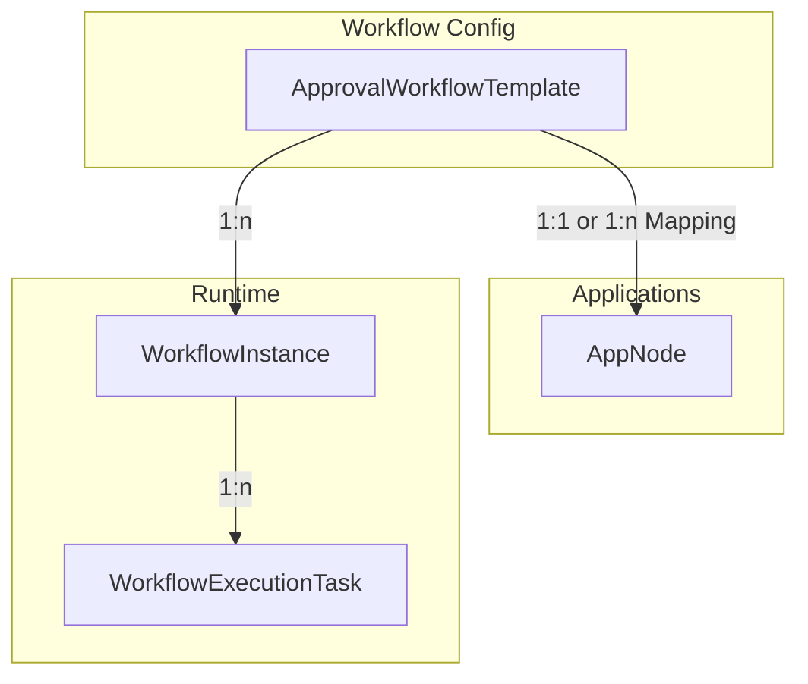
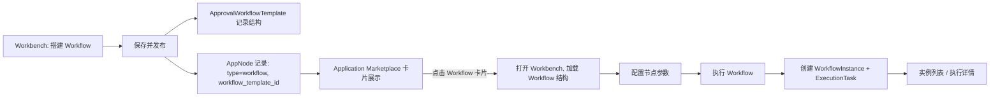

# Workflow保存即发布 & 无独立模板库方案（集成到 Application Marketplace）

## 一、需求重述

- **保存即发布**：在 Workbench 中创建的 Workflow，点击“保存模板”后立即可用（无需审核流程）。
- **无独立模板库**：不再在单独的“Workflow 模板库”里展示和管理模板，而是：
  - 把已发布的 Workflow **当作一种特殊的 Application**，
  - 直接以卡片形式展示在 **Application Marketplace** 中，复用现有应用卡片的 UI/交互。
- **多实例化运行**：从 Marketplace 选择某个 Workflow 卡片，在 Workbench 中通过“使用模板 + 配置节点参数”方式，多次运行，形成多个执行实例记录。
- **UI 不暴露结构可/不可修改逻辑**：
  - 不出现“允许修改模板结构”的开关；
  - 不出现“模板结构不可修改”的提示；
  - 对用户而言，Workflow 卡片和普通 Application 卡片在视觉上统一，只是进入 Workbench 后表现为“结构固定 + 节点参数可配置”。

---

## 二、现有 Application Marketplace 机制梳理

### 2.1 主要组件与数据流

**核心组件**：`ApplicationMarketplace`（卡片瀑布流/宫格展示）
- 位置：`frontend/src/components/ApplicationMarketplace/ApplicationMarketplace.tsx`
- 关键点：
  - 通过 `AppNodeService.getUserApps()` + `AppNodeService.getUserEditableApps()` 加载用户可访问的 `AppNode` 列表：

```ts
137:  const loadAllApps = React.useCallback(async () => {
138:    try {
139:      setIsLoading(true)
140:      const [accessibleApps, editableApps] = await Promise.all([
141:        AppNodeService.getUserApps(),
142:        AppNodeService.getUserEditableApps(),
143:      ])
...
160:      const apps = Array.from(merged.values())
167:      setAllApps(apps)
168:      setFilteredApps(apps)
```

  - 使用 `filteredApps.map(app => <Box ...>...</Box>)` 渲染卡片：

```ts
391:  {filteredApps.map((app) => {
392:    const isPinned = isAppPinned(app)
394:    return (
395:      <Box key={app.id} ... onClick={() => { handleAppSelect(app) }}>
...
476:          <Heading fontSize="sm" fontWeight="bold" ...>
487:            {app.name}
...
487:          {app.name}
...
490:          {app.status === "draft" && <Badge ...>Draft</Badge>}
```

- Marketplace 入口：
  - Workbench 侧边栏中通过 Modal 打开 `ApplicationMarketplace`：

```ts
// frontend/src/components/Workbench/WorkbenchSidebar.tsx
958:  <Modal isOpen={isMarketplaceOpen} ...>
968:    <ModalHeader>Application Marketplace</ModalHeader>
...
971:    <ApplicationMarketplace ... />
```

  - AppNodeSelector 中也有快速入口按钮：

```ts
// frontend/src/components/AppNode/AppNodeSelector.tsx
217:  {mode === "standard" && (
219:    <Button onClick={onShowMarketplace}>Application Marketplace</Button>
```

**结论**：
- 现在 Marketplace 的“应用卡片”本质是 `AppNode` 对象；
- UI 已经具备成熟的卡片布局（名称、描述、状态、分类/区域 Badge、Pin/unpin 交互）；
- 最理想的方案是：**Workflow 也落到 AppNode 概念下管理**，或通过扩展字段/类型，让 Marketplace 把部分 AppNode 识别为“Workflow 类型”的应用卡片。

---

## 三、统一模型：Workflow 作为特殊的 Application

### 3.1 概念归一

- **Application（AppNode）**：
  - 目前表示可配置、可运行的“应用单元”（大多数是单步 AI 应用）。
- **Workflow**：
  - 表示由多个节点（Start/App/Condition/HITL/Tool/End）组成的**编排流程**。

**统一设计**：
- 在 Marketplace 层面，**不做 Application vs Workflow 的硬分栏**，而是：
  - Workflow 模板保存后：
    - 在 `ApprovalWorkflowTemplate` 表中存结构；
    - 同时在 `AppNode`（或等价实体）中注册一个“Workflow 类型”的条目；
  - Marketplace 把这类条目当作普通 App 卡片渲染：
    - 名称：Workflow 名称
    - 描述：Workflow 描述 / 典型使用场景
    - 标签：`category = "workflow"` 或 `area = "workflow"`

### 3.2 后端数据模型关系（抽象）



- **`ApprovalWorkflowTemplate`**：
  - 存 `workflow_nodes` / `workflow_edges`（结构定义）
  - `resource_type = "workbench_workflow"`
- **`AppNode`**：
  - 增加或复用一个字段标识“此 App 是由 Workflow 驱动”：
    - 如 `app_type = "workflow"` 或在 `metadata` 里存 `workflow_template_id`
  - `name` / `description` 用于 Marketplace 展示
- **`WorkflowInstance`**：
  - 按之前方案存实例元数据和最终结果
- **`WorkflowExecutionTask`**：
  - 存执行过程与 `instance_id` 关联

> 对 Marketplace 而言，它只关心 `AppNode` 这一层；Workflow 结构和实例完全隐藏在后端/Workbench 中。

---

## 四、保存即发布：从 Workbench 到 Marketplace 的完整链路

### 4.1 开发者在 Workbench 中创建并保存 Workflow

**流程**：

```text
1. 在 Workbench 中拖拽节点，搭建 Workflow
2. 点击「保存模板」
3. 填写：名称、描述
4. 点击「保存并发布」
5. 后端：
   - 创建 ApprovalWorkflowTemplate（结构定义）
   - 创建/更新一个关联的 AppNode（type=workflow）
6. Application Marketplace 自动可以看到这个新卡片
```

**保存请求（保持简洁，不暴露结构可修改概念）**：

```http
POST /api/v1/workbench/workflows/save-template
Content-Type: application/json

{
  "name": "简历审核流程",
  "description": "自动分析简历并进行条件判断与人工审批",
  "nodes": [...],
  "edges": [...]
}
```

### 4.2 后端保存逻辑（示意）

```python
# 1) 保存 Workflow 模板结构

template = ApprovalWorkflowTemplate(
    name=request.name,
    description=request.description,
    resource_type="workbench_workflow",
    workflow_nodes=request.nodes,
    workflow_edges=request.edges,
    is_active=True,
    created_by=current_user.id,
)
session.add(template)
session.flush()  # 获得 template.id

# 2) 在 AppNode 中注册为一个 Workflow 类型的应用

app_node = AppNode(
    name=request.name,
    description=request.description,
    status="published",         # 复用 Application 已有发布状态
    app_type="workflow",        # 新增/复用字段，标识这是个 Workflow
    workflow_template_id=template.id,  # 新增字段，建立关联
    # 其他字段：category/area 可以根据业务设定
    category="workflow",
    area="workflow",
    owner_id=current_user.id,
)

session.add(app_node)
session.commit()
```

**要点**：
- Marketplace 只需要 `AppNodeService.getUserApps()` 就能拿到这个新 Workflow 卡片；
- 无需新的“workflow 模板库 API”；
- 删除 Workflow 时，只需软删模板 + 软删对应 AppNode，即可从 Marketplace 中消失。

---

## 五、Application Marketplace 中的展示与交互

### 5.1 渲染上的统一

沿用 `ApplicationMarketplace` 现有卡片布局：

```tsx
// 关键部分：渲染卡片
{filteredApps.map((app) => {
  return (
    <Box key={app.id} ... onClick={() => handleAppSelect(app)}>
      {/* 背景与 hover 效果 */}
      <Box ... />

      {/* 标题行 */}
      <HStack ...>
        <Icon as={FiGrid} ... />
        <Heading fontSize="sm" noOfLines={1}>{app.name}</Heading>
        {app.status === "draft" && <Badge>Draft</Badge>}
      </HStack>

      {/* 描述、标签等（可以扩展 category=workflow 的视觉标识） */}
    </Box>
  )
})
```

**针对 Workflow 的轻量标识（可选，但不提“模板”二字）**：
- 在 `AppNode.category` 或 `AppNode.area` 中使用 `"Workflow"`，在卡片上以 Badge 形式展示：
  - 示例：`<Badge colorScheme="purple">Workflow</Badge>`
- 文案只用 “Workflow”，不提“模板”，让客户自然理解为“这是一个可执行的工作流应用”。

### 5.2 点击 Workflow 卡片时的行为

现有 `ApplicationMarketplace` 对 `onAppSelect` 的处理：
- 在 `WorkbenchSidebar` 中，`onAppSelect` 只同步 pinnedApps；
- 对于 Workflow，我们需要在合适的入口（例如 Workbench 内）定义：
  - 点击某个 Workflow 卡片 → 打开 Workbench 并加载对应 Workflow 结构（使用模板，只读结构 + 可配置参数）。

**设计建议**：
- 在 Workbench 场景下，`ApplicationMarketplace` 的 `onAppSelect` 回调中：
  1. 识别 `app.app_type === "workflow"`；
  2. 调用新的后端 API：`GET /api/v1/workbench/workflows/from-app/{app_id}`：
     - 后端根据 `app_id` 找到 `workflow_template_id`，拉取 `workflow_nodes`/`workflow_edges`；
  3. 将 nodes/edges 加载到 FlowWorkspace，进入“使用模板”模式（结构只读）。

---

## 六、多实例运行：从 Marketplace 到实例列表

### 6.1 从 Workflow 卡片启动实例

**用户流程**：

```text
1. 在 Application Marketplace 中选择一个 Workflow 卡片（例如“简历审核流程”）
2. 点击卡片 → 打开 Workbench 的 Workflow 画布（只读结构）
3. 用户为本次执行配置节点参数（文件、提示词、审批人等）
4. 点击「执行」
5. 后端：
   - 创建 WorkflowInstance（记录这次运行）
   - 创建 WorkflowExecutionTask（执行引擎任务）
6. 前端：
   - 在“Workflow 实例列表”中展示多次运行记录
```

### 6.2 实例存储（沿用之前推荐方案）

- **`WorkflowInstance`**：
  - `template_id` → 指向 `ApprovalWorkflowTemplate.id`
  - `status` / `current_node_id` / `execution_result`
- **`WorkflowExecutionTask`**：
  - `instance_id` → 指向 `WorkflowInstance.id`
  - `nodes` / `edges` / `app_node_configs` / `node_results`

> Marketplace 不需要知道实例细节，只需在 Workflow 详情/执行页面提供“实例列表”视图即可。

---

## 七、与“独立模板库”方案的对比（为什么去掉模板库）

### 7.1 视觉/体验层面

- **独立模板库方案**：
  - 需要一个新的导航入口（Workflow 模板库）。
  - 模板列表 UI 与 Application Marketplace 极其相似（名称、描述、创建者、使用次数、按钮）。
  - 容易造成“两个地方都有长得很像的卡片”的混乱感。

- **无模板库 + 集成到 Marketplace 方案**：
  - 用户只需要记住一个地方：“所有可用东西都在 Application Marketplace 里”。
  - Workflow 与 Application 在视觉上统一，只是功能更偏“流程编排”。
  - 对 demo 来说，路径非常直观：
    - Marketplace 里点一个 Workflow 卡片 → 跳到 Workbench → 执行 → 回到实例列表。

### 7.2 架构/实现层面

- **去掉模板库**带来的好处：
  - 少一套前端页面（列表、筛选、分页、卡片、路由）；
  - 少一套 API（模板库专用 API）；
  - 权限与可见性可以完全复用 AppNode 的逻辑（谁能看到哪个 App）。

---

## 八、整体流程图（无模板库, 集成 Marketplace）



---

## 九、需要确认的关键决策

1. **Workflow 如何标识为“应用类型”**：
   - 是否接受在 `AppNode` 中增加 `app_type = "workflow"` 或等价字段？
   - 或者使用 `category = "workflow"` 作为轻量标识？

2. **点击 Workflow 卡片时的默认行为**：
   - 在 Marketplace 的通用语义下，是：
     - 对 Application：打开对应的 App 编辑/运行界面；
     - 对 Workflow：打开 Workbench 的 Workflow 画布，并进入“使用模板模式”。

3. **权限与可见性**：
   - 是否沿用 AppNode 现有发布/可见逻辑（例如 status="published" 才对他人可见）？
   - 结合你“保存即发布”的需求，建议：
     - 对 Workflow 类型 AppNode：保存时直接 `status="published"`。

4. **后续是否还需要“Workflow 分类页”**：
   - 如果未来 Workflow 数量很多，是否考虑在 Marketplace 内加“Workflow”筛选 Tab（不是单独库，只是筛选维度）？

---

## 十、总结

- **对客户视角**：
  - 不存在“Workflow 模板库”这个产品概念；
  - 只有一个统一的“Application Marketplace”；
  - Workflow 只是其中一种“更强大、可编排”的应用类型，以卡片方式展示。

- **对开发者视角**：
  - Workflow 的结构与实例存储在专用表（模板 / 实例 / 任务）；
  - Marketplace 只关心 AppNode 层，通过 `workflow_template_id` 关联结构；
  - 保存即发布 = 写入 Template + 注册/更新 AppNode；
  - 多实例运行 = 从 AppNode 找到 Template，再创建 Instance + ExecutionTask。

如果你确认这条“**无独立模板库，Workflow 卡片直接进 Marketplace**”的路线，我可以在下一步为你拆解具体改造任务（后端 API 变更 + 前端集成点），并对照 1.15 demo 的时间线给出最小可用闭环实现清单。