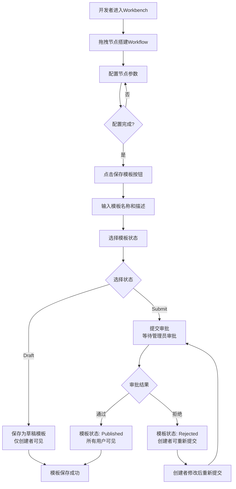
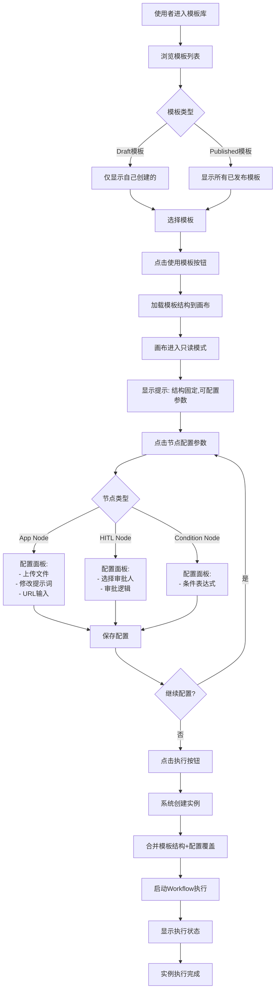
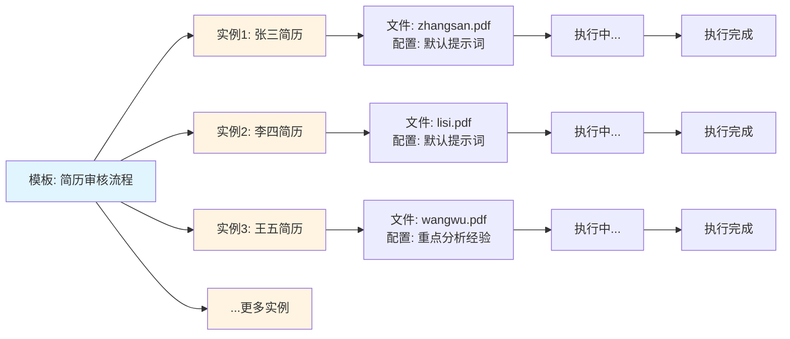

# Workflow模板使用场景详解

## 一、核心约束说明

### 模板使用的基本原则

**✅ 可以修改的内容**：
- Node节点内的配置参数（如提示词、要求等）
- App Node的文件上传（重新上传不同的文件）
- App Node的URL输入（修改URL地址）
- 输入数据（input_data）

**❌ 不能修改的内容**：
- 节点数量（不能增删节点）
- 节点之间的连线（edges）
- 节点类型（不能改变节点类型）
- 流程结构（不能改变workflow的执行流程）

---

## 二、详细使用场景

### 场景1：HR批量审核简历（最典型场景）

#### 步骤1：创建并保存模板

**开发者操作**：
1. 在Workbench中搭建workflow：
   ```
   Start → App Node（简历分析）→ Condition Node（判断是否符合）→ HITL Node（人工审批）→ End
   ```
2. 配置App Node：
   - 选择"简历分析"Application
   - 设置默认提示词："分析简历，提取关键信息"
   - 设置输入模式：File Upload（但此时不上传文件）
3. 配置Condition Node：
   - 条件：`score > 80`
4. 配置HITL Node：
   - 审批人：HR经理
5. **保存为模板**：
   - 名称："简历审核流程"
   - 状态：draft（创建者私有）

**模板保存的内容**：
```json
{
  "name": "简历审核流程",
  "nodes": [
    {"id": "start-1", "type": "start", ...},
    {"id": "app-1", "type": "app", "data": {"appNodeId": 123, ...}},
    {"id": "condition-1", "type": "condition", "data": {"condition": "score > 80"}},
    {"id": "hitl-1", "type": "humanInTheLoop", "data": {"approverJobTitleIds": [5]}},
    {"id": "end-1", "type": "end", ...}
  ],
  "edges": [
    {"source": "start-1", "target": "app-1"},
    {"source": "app-1", "target": "condition-1"},
    {"source": "condition-1", "target": "hitl-1", "condition": "true"},
    {"source": "condition-1", "target": "end-1", "condition": "false"},
    {"source": "hitl-1", "target": "end-1"}
  ]
}
```

#### 步骤2：使用模板创建多个实例

**使用者操作**（每天审核10份简历）：

**实例1：审核张三的简历**
1. 选择模板："简历审核流程"
2. 系统加载模板的nodes和edges（结构固定，不能修改）
3. **配置覆盖**：
   - App Node（app-1）：
     - 上传文件：`zhangsan_resume.pdf`
     - 修改提示词："重点分析工作经验和技能匹配度"（可选）
4. 点击"执行"
5. 系统创建实例1，使用模板的nodes和edges，但使用新的文件配置

**实例2：审核李四的简历**
1. 选择模板："简历审核流程"
2. 系统加载模板的nodes和edges（结构固定，不能修改）
3. **配置覆盖**：
   - App Node（app-1）：
     - 上传文件：`lisi_resume.pdf`
     - 保持默认提示词（不覆盖）
4. 点击"执行"
5. 系统创建实例2，使用模板的nodes和edges，但使用新的文件配置

**实例3-10：类似操作**
- 每次选择同一个模板
- 每次上传不同的简历文件
- 流程结构完全一致，只是文件不同

**关键点**：
- ✅ 10个实例使用相同的nodes和edges结构
- ✅ 每个实例使用不同的文件（通过app_node_configs覆盖）
- ✅ 不能修改节点数量、连线、流程结构
- ✅ 可以修改App Node的配置参数（文件、提示词等）

---

### 场景2：合同审批（不同审批人）

#### 步骤1：创建并保存模板

**开发者操作**：
1. 搭建workflow：
   ```
   Start → App Node（合同分析）→ HITL Node（审批）→ End
   ```
2. 配置App Node：
   - 选择"合同分析"Application
   - 设置默认提示词："分析合同条款，提取关键信息"
3. 配置HITL Node：
   - 审批人：默认选择"财务总监"（但可以在使用时覆盖）
4. **保存为模板**："合同审批流程"

#### 步骤2：使用模板创建多个实例

**实例1：北京地区合同**
1. 选择模板："合同审批流程"
2. **配置覆盖**：
   - App Node：上传文件 `beijing_contract.pdf`
   - HITL Node：修改审批人为"北京财务总监"
3. 执行

**实例2：上海地区合同**
1. 选择模板："合同审批流程"
2. **配置覆盖**：
   - App Node：上传文件 `shanghai_contract.pdf`
   - HITL Node：修改审批人为"上海财务总监"
3. 执行

**关键点**：
- ✅ 流程结构完全一致（Start → App → HITL → End）
- ✅ 每个实例使用不同的文件和审批人（通过配置覆盖）
- ✅ 不能修改节点数量、连线、流程结构

---

### 场景3：供应商审核（不同分析要求）

#### 步骤1：创建并保存模板

**开发者操作**：
1. 搭建workflow：
   ```
   Start → App Node（供应商分析）→ Condition Node（判断）→ HITL Node（审批）→ End
   ```
2. 配置App Node：
   - 选择"供应商分析"Application
   - 设置默认提示词："分析供应商资质和财务状况"
3. **保存为模板**："供应商审核流程"

#### 步骤2：使用模板创建多个实例

**实例1：审核新供应商（详细分析）**
1. 选择模板："供应商审核流程"
2. **配置覆盖**：
   - App Node：
     - 上传文件：`new_supplier_info.pdf`
     - 修改提示词："详细分析供应商资质、财务状况、历史合作记录，重点关注风险点"
3. 执行

**实例2：审核老供应商（快速审核）**
1. 选择模板："供应商审核流程"
2. **配置覆盖**：
   - App Node：
     - 上传文件：`old_supplier_info.pdf`
     - 修改提示词："快速审核供应商资质，重点关注是否有变更"
3. 执行

**关键点**：
- ✅ 流程结构完全一致
- ✅ 每个实例使用不同的文件和提示词（通过配置覆盖）
- ✅ 不能修改节点数量、连线、流程结构

---

## 三、技术实现说明

### 模板数据结构

```json
{
  "id": 1,
  "name": "简历审核流程",
  "status": "draft",
  "nodes": [
    {
      "id": "app-1",
      "type": "app",
      "data": {
        "appNodeId": 123,
        "executionConfig": {
          "params": {
            "requirement": "分析简历，提取关键信息"  // 默认配置
          }
        }
      }
    }
  ],
  "edges": [
    {"source": "start-1", "target": "app-1"},
    {"source": "app-1", "target": "condition-1"}
  ]
}
```

### 创建实例时的配置覆盖

```json
{
  "template_id": 1,
  "app_node_configs": {
    "app-1": {
      "inputMode": "file",
      "dagRunId": "dag_run_123",  // 新上传的文件
      "requirement": "重点分析工作经验和技能匹配度"  // 覆盖默认提示词
    }
  },
  "input_data": {
    "candidate_name": "张三"
  }
}
```

### 执行时的合并逻辑

```python
# 1. 从模板加载nodes和edges（结构固定）
template = get_template(template_id)
nodes = template.nodes  # 不能修改
edges = template.edges   # 不能修改

# 2. 合并配置覆盖
for node in nodes:
    if node['id'] in app_node_configs:
        # 覆盖节点配置，但不改变节点结构
        node_config = app_node_configs[node['id']]
        # 合并到node的data中
        node['data'].update(node_config)

# 3. 执行workflow
execute_workflow(nodes, edges, input_data)
```

---

## 四、完整使用流程图

### 4.1 模板创建与保存流程



### 4.2 使用模板创建实例流程



### 4.3 多实例运行流程



---

## 五、UI界面预览

### 5.1 模板库界面

```
┌─────────────────────────────────────────────────────────────────┐
│  Workflow模板库                                    [+ 新建模板] │
├─────────────────────────────────────────────────────────────────┤
│                                                                   │
│  ┌──────────────────┐  ┌──────────────────┐                  │
│  │ 📋 简历审核流程   │  │ 📋 合同审批流程   │                  │
│  │                  │  │                  │                  │
│  │ 状态: Draft      │  │ 状态: Published  │                  │
│  │ 创建者: 小王     │  │ 创建者: 小李     │                  │
│  │ 创建时间: 1.10   │  │ 创建时间: 1.8    │                  │
│  │                  │  │                  │                  │
│  │ [使用模板]       │  │ [使用模板]       │                  │
│  └──────────────────┘  └──────────────────┘                  │
│                                                                   │
│  ┌──────────────────┐  ┌──────────────────┐                  │
│  │ 📋 供应商审核流程 │  │ 📋 文档分析流程   │                  │
│  │                  │  │                  │                  │
│  │ 状态: Published  │  │ 状态: Draft      │                  │
│  │ 创建者: 小张     │  │ 创建者: 我        │                  │
│  │ 创建时间: 1.5    │  │ 创建时间: 1.12   │                  │
│  │                  │  │                  │                  │
│  │ [使用模板]       │  │ [使用模板]       │                  │
│  └──────────────────┘  └──────────────────┘                  │
│                                                                   │
└─────────────────────────────────────────────────────────────────┘
```

### 5.2 使用模板 - 只读画布模式

```
┌─────────────────────────────────────────────────────────────────┐
│  ← 返回模板库    简历审核流程 (模板)          [执行] [取消]      │
├─────────────────────────────────────────────────────────────────┤
│                                                                   │
│  ⚠️ 提示: 这是模板结构，不能修改。您可以配置节点参数。           │
│                                                                   │
│  ┌─────────┐                                                     │
│  │  START  │                                                     │
│  └────┬────┘                                                     │
│       │                                                          │
│       ▼                                                          │
│  ┌─────────────────────┐                                        │
│  │   App Node          │  ← 点击配置参数                        │
│  │   简历分析          │                                        │
│  │   [配置]            │                                        │
│  └────┬────────────────┘                                        │
│       │                                                          │
│       ▼                                                          │
│  ┌─────────────────────┐                                        │
│  │ Condition Node      │                                        │
│  │   score > 80        │                                        │
│  └────┬────────────────┘                                        │
│       │                                                          │
│       ├──────────────┬──────────────┐                          │
│       ▼              ▼              ▼                          │
│  ┌─────────┐  ┌─────────┐  ┌─────────┐                      │
│  │  HITL   │  │   END   │  │   END   │                      │
│  │  审批   │  │         │  │         │                      │
│  └─────────┘  └─────────┘  └─────────┘                      │
│                                                                   │
│  🔒 只读模式: 不能拖拽、不能增删节点、不能修改连线                │
│                                                                   │
└─────────────────────────────────────────────────────────────────┘
```

### 5.3 节点配置面板（App Node）

```
┌─────────────────────────────────────────────────────────────────┐
│  配置节点: App Node (app-1)                            [× 关闭] │
├─────────────────────────────────────────────────────────────────┤
│                                                                   │
│  节点信息                                                         │
│  ┌─────────────────────────────────────────────────────────┐   │
│  │ 节点类型: App Node                                      │   │
│  │ 节点ID: app-1 (不可修改)                                │   │
│  │ Application: 简历分析                                   │   │
│  └─────────────────────────────────────────────────────────┘   │
│                                                                   │
│  配置参数 (可修改)                                                │
│  ┌─────────────────────────────────────────────────────────┐   │
│  │ 输入模式: ○ URL  ● 文件上传                              │   │
│  │                                                          │   │
│  │ 文件上传:                                                │   │
│  │ ┌──────────────────────────────────────────────────┐   │   │
│  │ │  [选择文件] 或拖拽文件到此处                      │   │   │
│  │ │  当前文件: zhangsan_resume.pdf                    │   │   │
│  │ └──────────────────────────────────────────────────┘   │   │
│  │                                                          │   │
│  │ 提示词 (可选覆盖):                                       │   │
│  │ ┌──────────────────────────────────────────────────┐   │   │
│  │ │ 重点分析工作经验和技能匹配度                      │   │   │
│  │ │ (留空则使用模板默认提示词)                        │   │   │
│  │ └──────────────────────────────────────────────────┘   │   │
│  └─────────────────────────────────────────────────────────┘   │
│                                                                   │
│  [保存配置]  [取消]                                              │
│                                                                   │
└─────────────────────────────────────────────────────────────────┘
```

### 5.4 节点配置面板（HITL Node）

```
┌─────────────────────────────────────────────────────────────────┐
│  配置节点: HITL Node (hitl-1)                          [× 关闭] │
├─────────────────────────────────────────────────────────────────┤
│                                                                   │
│  节点信息                                                         │
│  ┌─────────────────────────────────────────────────────────┐   │
│  │ 节点类型: Human in the Loop                             │   │
│  │ 节点ID: hitl-1 (不可修改)                               │   │
│  └─────────────────────────────────────────────────────────┘   │
│                                                                   │
│  配置参数 (可修改)                                                │
│  ┌─────────────────────────────────────────────────────────┐   │
│  │ 审批标题: 简历审核审批                                    │   │
│  │                                                          │   │
│  │ 审批人选择:                                              │   │
│  │ ┌──────────────────────────────────────────────────┐   │   │
│  │ │ ☑ HR经理 (默认)                                    │   │   │
│  │ │ ☐ 财务总监                                         │   │   │
│  │ │ ☐ 部门主管                                         │   │   │
│  │ │ [+ 添加审批人]                                     │   │   │
│  │ └──────────────────────────────────────────────────┘   │   │
│  │                                                          │   │
│  │ 审批逻辑: ● any  ○ all  ○ majority                      │   │
│  │ (任意一人通过即可)                                      │   │
│  └─────────────────────────────────────────────────────────┘   │
│                                                                   │
│  [保存配置]  [取消]                                              │
│                                                                   │
└─────────────────────────────────────────────────────────────────┘
```

### 5.5 执行实例界面

```
┌─────────────────────────────────────────────────────────────────┐
│  实例执行: 简历审核流程 - 张三简历                    [查看详情] │
├─────────────────────────────────────────────────────────────────┤
│                                                                   │
│  执行状态: 🟢 运行中                                             │
│  开始时间: 2026-01-15 10:30:00                                  │
│                                                                   │
│  节点执行进度:                                                    │
│  ┌─────────────────────────────────────────────────────────┐   │
│  │ ✅ START                  [10:30:00] 已完成              │   │
│  │                                                          │   │
│  │ 🔵 App Node (简历分析)    [10:30:05] 运行中...          │   │
│  │    文件: zhangsan_resume.pdf                            │   │
│  │                                                          │   │
│  │ ⏸️  Condition Node        [等待中] 未开始               │   │
│  │                                                          │   │
│  │ ⏸️  HITL Node (审批)      [等待中] 未开始               │   │
│  │                                                          │   │
│  │ ⏸️  END                   [等待中] 未开始               │   │
│  └─────────────────────────────────────────────────────────┘   │
│                                                                   │
│  实时日志:                                                        │
│  ┌─────────────────────────────────────────────────────────┐   │
│  │ [10:30:00] Workflow执行开始                             │   │
│  │ [10:30:01] App Node开始分析文件...                      │   │
│  │ [10:30:05] App Node分析中，预计还需2分钟...            │   │
│  └─────────────────────────────────────────────────────────┘   │
│                                                                   │
└─────────────────────────────────────────────────────────────────┘
```

### 5.6 实例列表界面

```
┌─────────────────────────────────────────────────────────────────┐
│  我的Workflow实例                                    [筛选] [排序] │
├─────────────────────────────────────────────────────────────────┤
│                                                                   │
│  模板: 简历审核流程                                               │
│  ┌──────────────────────────────────────────────────────────┐  │
│  │ 实例1: 张三简历                    🟢 运行中              │  │
│  │ 创建时间: 10:30:00  执行时间: 5分钟                       │  │
│  │ [查看详情] [停止]                                        │  │
│  ├──────────────────────────────────────────────────────────┤  │
│  │ 实例2: 李四简历                    ✅ 已完成              │  │
│  │ 创建时间: 10:25:00  执行时间: 8分钟                       │  │
│  │ [查看详情] [重新执行]                                    │  │
│  ├──────────────────────────────────────────────────────────┤  │
│  │ 实例3: 王五简历                    ⏸️ 等待审批             │  │
│  │ 创建时间: 10:20:00  执行时间: 3分钟                       │  │
│  │ [查看详情] [继续执行]                                    │  │
│  └──────────────────────────────────────────────────────────┘  │
│                                                                   │
│  模板: 合同审批流程                                               │
│  ┌──────────────────────────────────────────────────────────┐  │
│  │ 实例1: 北京合同                    ✅ 已完成              │  │
│  │ 创建时间: 09:00:00  执行时间: 15分钟                      │  │
│  │ [查看详情] [重新执行]                                    │  │
│  └──────────────────────────────────────────────────────────┘  │
│                                                                   │
└─────────────────────────────────────────────────────────────────┘
```

---

## 六、UI交互设计说明

### 6.1 只读模式设计

**画布只读模式特性**：
- ❌ **禁用拖拽**：节点不能拖拽移动
- ❌ **禁用增删**：不能添加新节点，不能删除节点
- ❌ **禁用连线**：不能创建新连线，不能删除连线
- ✅ **允许点击**：可以点击节点打开配置面板
- ✅ **允许查看**：可以查看节点信息和流程结构

**视觉提示**：
- 画布背景显示半透明遮罩或特殊颜色
- 节点显示锁定图标 🔒
- 顶部显示提示横幅："这是模板结构，不能修改。您可以配置节点参数。"

### 6.2 配置面板设计

**可配置项（根据节点类型）**：

**App Node**：
- ✅ 文件上传（重新上传文件）
- ✅ 提示词（修改requirement）
- ✅ URL输入（如果支持）
- ❌ 节点类型（不可修改）
- ❌ 节点ID（不可修改）
- ❌ Application选择（不可修改，使用模板默认）

**HITL Node**：
- ✅ 审批人选择（可以覆盖模板默认）
- ✅ 审批逻辑（可以覆盖模板默认）
- ✅ 审批标题和描述
- ❌ 节点类型（不可修改）
- ❌ 节点ID（不可修改）

**Condition Node**：
- ✅ 条件表达式（可以覆盖模板默认）
- ❌ 节点类型（不可修改）
- ❌ 节点ID（不可修改）

### 6.3 执行按钮设计

**执行前检查**：
- 检查必填配置（如App Node必须上传文件或输入URL）
- 检查审批人是否已选择（HITL Node）
- 显示配置摘要（哪些节点使用了覆盖配置）

**执行后反馈**：
- 创建实例成功提示
- 跳转到实例执行页面
- 显示实例ID和执行状态

---

## 七、常见问题

### Q1: 如果我想修改流程结构怎么办？

**A**: 需要回到Workbench编辑模板，保存新版本。不能在使用模板时修改结构。

### Q2: 如果我想添加一个节点怎么办？

**A**: 需要回到Workbench编辑模板，添加节点后保存。不能在使用模板时添加节点。

### Q3: 配置覆盖是必须的吗？

**A**: 不是。如果使用默认配置，可以不提供app_node_configs。系统会使用模板中的默认配置。

### Q4: 可以只覆盖部分节点的配置吗？

**A**: 可以。app_node_configs只需要包含要覆盖的节点配置，其他节点使用模板默认配置。

### Q5: 模板保存后，还能修改吗？

**A**: 可以。创建者可以编辑自己的draft模板，修改后保存。但已创建的实例不会受影响（实例使用的是创建时的模板快照）。

---

## 八、总结

### 核心设计理念

**模板 = 结构固定 + 配置可覆盖**

- **结构固定**：nodes和edges在模板中定义，使用模板时不能修改
- **配置可覆盖**：节点内的配置参数可以通过app_node_configs覆盖

### 使用场景

1. **批量处理**：使用同一模板处理不同数据（文件、参数）
2. **个性化配置**：使用同一模板但不同配置（审批人、提示词等）
3. **标准化流程**：确保团队使用统一的流程结构

### 技术实现

- 模板保存：nodes + edges + 默认配置
- 实例创建：模板nodes/edges + 配置覆盖（app_node_configs）
- 执行：合并后的完整workflow定义

